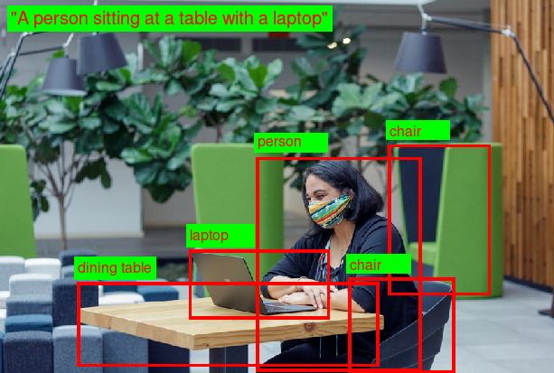

# Azure AI Vision SDK (Preview) Samples

This repository hosts sample code and setup documents for the Microsoft Azure AI Vision SDK (Preview).

## News

* Vision SDK 0.9.0-beta.1 was released on March 2023, targeting Image Analysis applications on Windows and Linux platforms.

<!-- [See release notes](https://github.com/Azure-Samples/azure-ai-vision-sdk/releases/tag/0.8.0-alpha.0.33370873) -->

## Features

This repository hosts samples that help you get started with several features of the SDK in public preview. This includes the following API sets:

* [Image Analysis](#image-analysis)

Other API sets are under development.

## Support

Please [open a new issue in this repo](https://github.com/Azure-Samples/azure-ai-vision-sdk/issues) if you encounter any problems building or running the samples, or have any additional questions about the SDK. This is the preferred method of getting support. Note that these issues will be visible to the public, so please do not include any sensitive information.

Alternatively, you can contact Microsoft's Vision SDK development team directly by sending an e-mail to  `vision-sdk@microsoft.com`.

## Get the SDK samples

* **Running the samples in this repository requires you to install the Azure AI Vision SDK. By doing so you acknowledge the [Azure AI Vision SDK license agreement](https://aka.ms/azai/vision/license)**.

* The easiest way to get access to these samples is to download the content of this repo as a [ZIP file](https://github.com/Azure-Samples/azure-ai-vision-sdk/archive/master.zip).

* Alternatively, you can use a Git client to clone this repository to your hard drive by running

  ```
  git clone https://github.com/Azure-Samples/azure-ai-vision-sdk.git
  ```

## Image Analysis

### Overview



See Microsoft documentation for an overview of [Image Analysis](https://learn.microsoft.com/azure/cognitive-services/computer-vision/overview-image-analysis). The Vision SDK Image Analysis APIs (preview) uses [Image Analysis REST API v4.0 (preview)](docs/image-analysis/Image-Analysis-2023-02-01-preview-API-doc.md). The Image Analysis APIs supports the extraction of one or more of the following features using a single REST call:

* **Caption** - Generates a human-readable phrase that describes the image content. For example, for the above image, "A woman wearing a mask sitting at a table with a laptop".
* **Tags** - Returns content tags for recognizable objects, living beings, scenery, and actions that appear in the image.
* **Objects** - Detects various objects within an image, including their approximate location. See example in the above image: person, two chairs, laptop, dining table.
* **People** - Detects people in the image, including their approximate location.
* **Text** - Also known as **Read** or **OCR**. Performs Optical Character Recognition (OCR) and returns the text detected in the image, including the approximate location of every text line and word.
* **Crop Suggestions** - Also known as **Smart Crop**. Recommendations for cropping operations that preserve content (e.g. for thumbnail generation).

You can either upload an image for analysis by providing the name of an image file on disk, or you can provide a publicly-accessible URL of the image.

### Supported Programming Languages and Platforms

At the moment the SDK is available for the following platforms and programming languages:

* Platforms:
  * Windows 10 x64 (and above)
  * Linux x64 running Ubuntu 18.04/20.04/22.04, Debian 9/10/11, Red Hat Enterprise Linux (RHEL) 7/8

* Programming languages:
  * Python
  * C# (.NET Core)
  * C++

Support for others platform and programming languages (including Android, iOS, MacOS) is planned for future releases.

If your platform and/or programming language is not listed above, your application will need to directly implement REST calls to the Vision Service using the [Image Analysis REST API v4.0 (preview)](https://aka.ms/vision-4-0-ref).

### Samples

The samples will show how to analyze an image file from local disk or an image URL. Click on the links below for detailed setup, build and run instructions corresponding to your programming language.

There are currently three samples, with more to come:

1. Analyze all features from a JPEG image file on disk and print detailed results to the console. This is done using the synchronous (blocking) API. Start by looking at this sample first.
1. Analyze one feature from an image URL, using the asynchronous (non-blocking) API, while registering for an event to get the analysis results.
1. Analyze an image using a custom-trained model. To run this sample, you first need to create a custom model. See [Image Analysis overview](https://learn.microsoft.com/azure/cognitive-services/computer-vision/overview-image-analysis) for more deatils.

Click on the link below corresponding to programming language:

| Programming Language |
| -------- |
| [C++](samples/cpp/image-analysis) |
| [C# .NET Core](samples/csharp/image-analysis/dotnetcore) |
| [Python](samples/python/image-analysis) |

If your platform and/or programming language is not listed above, your application will need to directly implement REST calls to the Vision service using the [Image Analysis REST API v4.0 (preview)](https://aka.ms/vision-4-0-ref).

### API Reference Documentation

* [C++ API Reference Documents]( https://learn.microsoft.com/cpp/api/azure.ai.vision.imageanalysis)
* [C# .NET Core API Reference Documents](https://learn.microsoft.com/dotnet/api/azure.ai.vision.imageanalysis)
* [Python API Reference Documents](https://learn.microsoft.com/python/api/azure-ai-vision)

