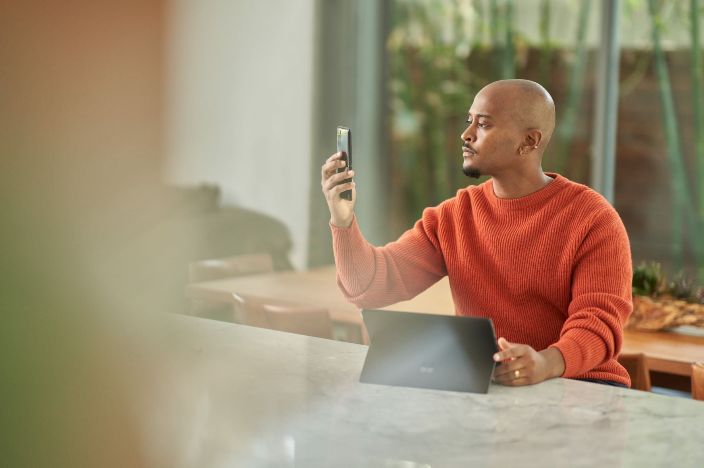

# Azure AI Vision SDK (Preview) Samples

This repository hosts sample code and setup documents for the Microsoft Azure AI Vision SDK (Preview).

## News

* **Vision SDK 0.16.0-beta.1** released November 2023 that adds Azure AI Vision Face features.
* **Vision SDK 0.15.1-beta.1** released September 2023.
  * Add support for Java JRE on Windows x64 and Linux x64.
  * Input image can now be provided from a memory buffer (in addition to from file or URL).
* **Vision SDK 0.13.0-beta.1** released July 2023. Image Analysis support was added for Universal Windows Platform (UWP) applications (C++, C#). Run-time package size reduction: Only the two native binaries 
`Azure-AI-Vision-Native.dll` and `Azure-AI-Vision-Extension-Image.dll` are now needed.
* **Vision SDK 0.11.1-beta.1** released May 2023. Image Analysis APIs were updated to support [Background Removal](https://learn.microsoft.com/azure/ai-services/computer-vision/concept-background-removal).
* **Vision SDK 0.10.0-beta.1** released April 2023. Image Analysis APIs were updated to support [Dense Captions](https://learn.microsoft.com/azure/ai-services/computer-vision/concept-describe-images-40?tabs=dense).
* **Vision SDK 0.9.0-beta.1** first released on March 2023, targeting Image Analysis applications on Windows and Linux platforms.

## Features

This repository hosts samples that help you get started with several features of the SDK in public preview. This includes the following API sets:

* [Face Analysis](#face-analysis)

Other API sets are under development.

## Support

Please [open a new issue in this repo](https://github.com/Azure-Samples/azure-ai-vision-sdk/issues) if you encounter any problems building or running the samples, or have any additional questions about the SDK. This is the preferred method of getting support. Note that these issues will be visible to the public, so please do not include any sensitive information.

Alternatively, you can contact Microsoft's Vision SDK development team directly by sending an e-mail to  `vision-sdk@microsoft.com`.

## Get the SDK samples

* **Running the samples in this repository requires you to install the Azure AI Vision SDK. By doing so you acknowledge the [Azure AI Vision SDK license agreement](https://aka.ms/azai/vision/license)**.

* The easiest way to get access to these samples is to download the content of this repo as a [ZIP file](https://github.com/Azure-Samples/azure-ai-vision-sdk/archive/master.zip).

* Alternatively, you can use a Git client to clone this repository to your hard drive by running

  ```
  git clone https://github.com/Azure-Samples/azure-ai-vision-sdk.git
  ```

## Image Analysis

**January 2024 update**: Samples for the new Image Analysis SDK versions 1.0.0-beta.1 and up are now located in several other Azure SDK GitHub repos. Please see the [Image Analysis SDK overview]([text](https://learn.microsoft.com/azure/ai-services/computer-vision/sdk/overview-sdk)) page for more details.

## Face Analysis

### Overview


See Microsoft documentation for an overview of [Azure AI Vision Face Liveness Detection](https://aka.ms/azure-ai-vision-face-liveness-tutorial).

This SDK supports two feature variants:
- Liveness with Verification
- Liveness

Liveness detection aims to verify that the system engages with a physically present, living individual during the verification process. This is achieved by differentiating between a real (live) and fake (spoof) representation which may include photographs, videos, masks, or other means to mimic a real person.

The new Face liveness detection solution is a combination of mobile SDK and Azure AI service. It is conformant to ISO/IEC 30107-3 PAD (Presentation Attack Detection) standards as validated by iBeta level 1 and level 2 conformance testing. It successfully defends against a plethora of spoof types ranging from paper printouts, 2D/3D masks, and spoof presentations on phones and laptops. Liveness detection is an active area of research, with continuous improvements being made to counteract increasingly sophisticated spoofing attacks over time, and continuous improvement will be rolled out to the client and the service components as the overall solution gets hardened against new types of attacks over time.

While blocking spoof attacks is the primary focus of the liveness solution, paramount importance is also given to allowing real users to successfully pass the liveness check with low friction. Additionally, the liveness solution complies with the comprehensive responsible AI and data privacy standards to ensure fair usage across demographics around the world through extensive fairness testing. For more information, please visit: [Empowering responsible AI practices | Microsoft AI](https://www.microsoft.com/ai/responsible-ai).

Please see the readme documents listed below for instructions on how to build and run each sample. 

### Prerequisite

- You will need to get access to the SDK artifacts in order to run these samples. To get started you would need to apply for the [Face Recognition Limited Access Features](https://customervoice.microsoft.com/Pages/ResponsePage.aspx?id=v4j5cvGGr0GRqy180BHbR7en2Ais5pxKtso_Pz4b1_xUQjA5SkYzNDM4TkcwQzNEOE1NVEdKUUlRRCQlQCN0PWcu) to get access to the SDK artifacts. Once you are approved please refer to the [GET_FACE_ARTIFACTS_ACCESS.md](./GET_FACE_ARTIFACTS_ACCESS.md) file to get access to the the SDK artifacts and the [Swift_README](./samples/swift/face/FaceAnalyzerSample/README.md), [Kotlin_README](./samples/kotlin/face/FaceAnalyzerSample/README.md) to integrate the SDK into the sample application. For more information, see the [Face Limited Access](https://learn.microsoft.com/legal/cognitive-services/computer-vision/limited-access-identity?context=%2Fazure%2Fcognitive-services%2Fcomputer-vision%2Fcontext%2Fcontext) page.  

### Samples

| Sample                                                   | Platform | Description                              |
| ------------------------------------------------------------ | -------- | ---------------------------------------- |
| [Kotlin sample app for Android](samples/kotlin/face) | Android | App with source code that demonstrates face analysis on Android |
| [Swift sample app for iOS](samples/swift/face) | iOS | App with source code that demonstrates face analysis on iOS |


### API Reference Documentation

* Kotlin API reference documents: [Azure SDK for Android](https://azure.github.io/azure-sdk-for-android/), [azure-ai-vision-common](https://azure.github.io/azure-sdk-for-android/azure-ai-vision-common/index.html), [azure-ai-vision-faceanalyzer](https://azure.github.io/azure-sdk-for-android/azure-ai-vision-faceanalyzer/com/azure/android/ai/vision/faceanalyzer/package-summary.html)
* Swift API reference documents: [Azure SDK for iOS Docs](https://azure.github.io/azure-sdk-for-ios/), [AzureAIVisionCore](https://azure.github.io/azure-sdk-for-ios/AzureAIVisionCore/index.html), [AzureAIVisionFace](https://azure.github.io/azure-sdk-for-ios/AzureAIVisionFace/index.html)