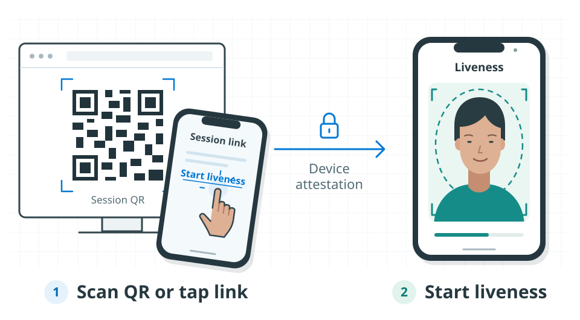
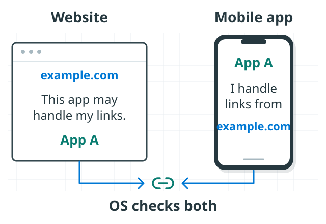
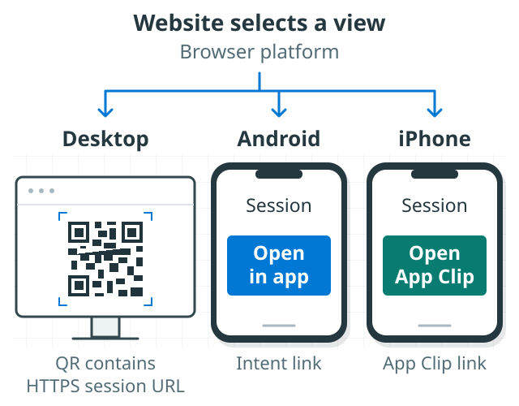
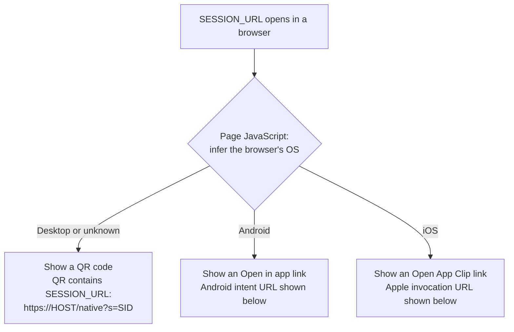
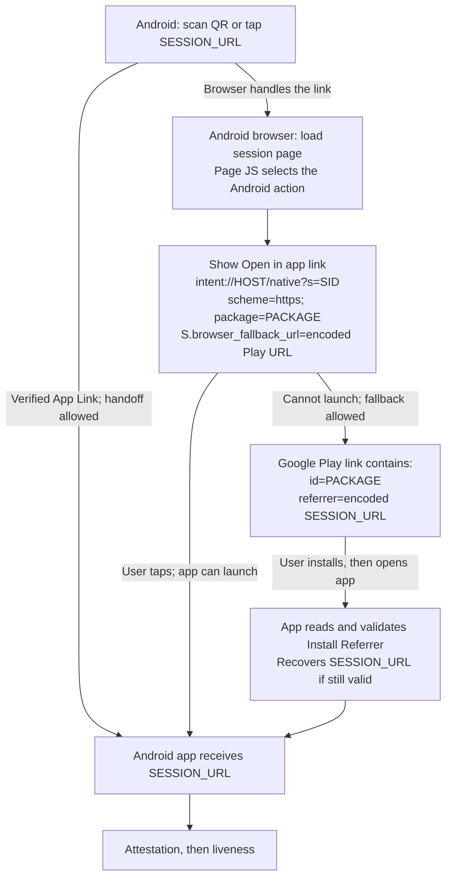
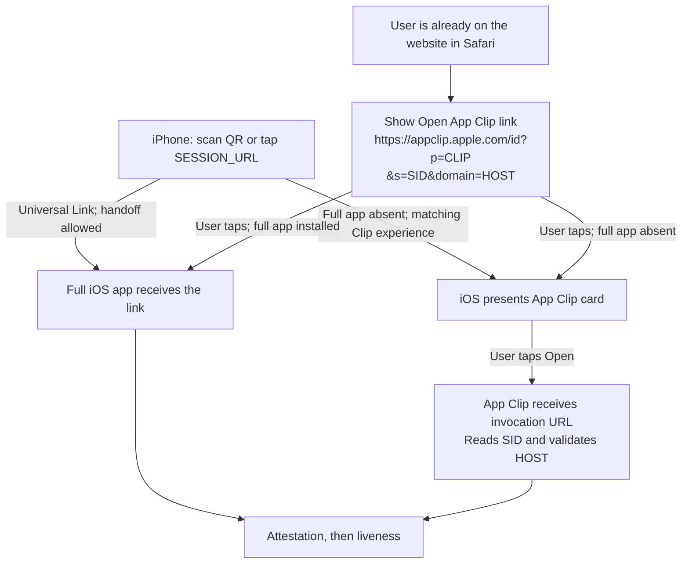
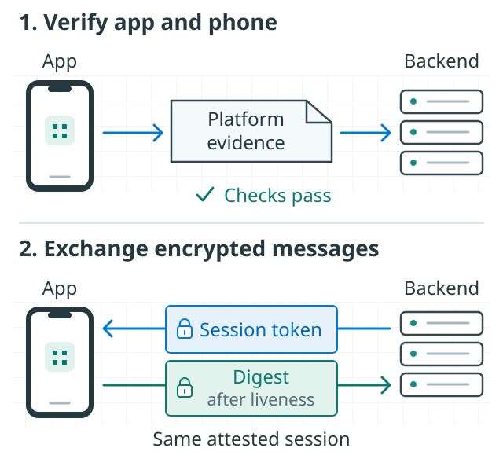

# How Web-to-Mobile Liveness Works

A user starts a liveness check on your website, then scans a QR code or taps
a link to continue in your Android app, iOS app, or iOS App Clip. Your
**backend** (the server behind your website) connects these steps using a
**session ID**, a reference number for that check. The liveness check assesses
whether a live person is in front of the camera.

This introduction explains the idea with examples. For implementation,
use the [integration quick start](README.md).



## 1. Scan a QR Code or Tap a Link

A session link is a web address for the check, such as
`https://liveness.example.com/native?s=...`. The value after `s=` is the
session ID, which identifies the check.

A QR code stores that same link as a scannable pattern. Your camera reads
the pattern and can offer to open the link.

Whether you tap the session link or open it from a QR scan, your phone
receives the same web address. Next, it decides: **should this link open
the app or a webpage?**

<details>
<summary>Optional: how the same text behaves in different programs</summary>

Consider the string `C:\Pictures\sample.jpg`. What happens depends on which
program receives it:

| Where You Pass the String | What Happens |
| --- | --- |
| `echo` or PowerShell's `Write-Output` | Prints the path. It does not open the file. |
| An image viewer | Opens that path, reads the file, and displays the image. |
| Notepad's file-open command | Reads the same file as text. A JPEG's binary contents usually look unreadable. |
| A command line inside Remote Desktop | Uses the remote computer's path. The file could be different or missing. |

The string does not become an image or unreadable text. The receiving program
chooses whether to print it, open a file, or do something else.

</details>

## 2. Your Phone Chooses App or Browser

To make that choice, the phone checks whether an installed app is allowed
to open links from that website. The website names the allowed app, and
the app names the website whose links it handles. This two-sided connection
is called an **association**, set up using **Android App Links** or
**iOS Universal Links**.



With that connection in place, the phone can open the app and pass it the
link, so the app can read the session ID and continue the check. If the link
opens in the browser instead, you reach a webpage. **How does that page
help you get to the app?**

<details>
<summary>Technical details: how the app and website are associated</summary>

| Platform | The App Declares | The Website Declares |
| --- | --- | --- |
| Android App Links | The HTTPS host and URL patterns it handles, in its manifest. | The allowed package name and signing-certificate fingerprint in `/.well-known/assetlinks.json`. |
| iOS Universal Links | The host in its signed Associated Domains entitlement. | The allowed app identifier and URL paths in `/.well-known/apple-app-site-association` (AASA). |

Android verifies the website's association against the installed app.
iOS verifies its association too, normally obtaining the AASA file through
Apple's content delivery network. **Universal Links do not require registering
each session URL with Apple.** App Clip experiences have additional App Store
Connect configuration, described below.

Both association files are hosted publicly over HTTPS without login or
redirects. Your app also validates the incoming host, path, and parameters
before using them.

This association answers **"Which app may open this link?"** It does not
replace your application's user authorization.

Installed apps can receive verified links directly, so the page may never be
loaded on the phone. However, camera apps, browser policies, user preferences,
and link context affect handoff. Typing a URL into a browser's address bar or
following a same-site link may stay in the browser even when the app is installed.
Test a real tap or scan and keep the fallback page usable.

See Google's [App Links explanation](https://developer.android.com/training/app-links/about)
and Apple's [associated domains explanation](https://developer.apple.com/documentation/xcode/supporting-associated-domains).

</details>

## 3. The Webpage Helps You Continue

When the link opens in a browser, design the page to give the user a
clear next step toward the app. Help users on a computer continue on
their phone, and help users already on a phone open the app.

Keep the user connected to the same check throughout these steps, even
when moving from one device to another.

<details>
<summary>Technical details: webpage actions and link contents</summary>

The webpage offers a way to open the app: **Open in app** on Android, or
**Open App Clip** on iPhone. An App Clip is a small part of an iOS app that
runs without installing the full app.

Because this page helps you continue when the link opens in the browser,
it is called a **fallback page**. It is also the page you can start from
on a computer, where it shows a QR code to scan with your phone.



The QR code and buttons carry the same session ID, so the app knows which
check to continue. They do not carry the **Face session token**, a temporary
credential that gives the app permission to run the check.

A webpage can use **JavaScript** (code that runs in the browser) to choose
which view to show based on the browser's operating system (OS), such as
Android or iOS.

The diagrams use `SESSION_URL` for `https://HOST/native?s=SID`. `HOST` is your
backend hostname, such as `liveness.example.com`, and `SID` is the same session
ID throughout. `PACKAGE` is the Android package name; `CLIP` is the App Clip
bundle ID. These names identify the apps to open. Optional browser-return
parameters are omitted.



The chart shows a browser-side approach. The
[sample](backend/react/app/_lib/session_landing.ts) instead selects the view
on the server using information sent by the browser (`User-Agent`), and also
displays the QR on mobile. This choice affects what the page shows; the phone
still controls whether a link opens an app.

The next two sections explain how to design these steps so the user has
a clear route into the app on Android or iPhone.

</details>

## 4. Android: From Link to Liveness

Whether the camera or a browser opens the link, design a clear path to
your Android app. Let the link open the installed app where possible.
If a webpage opens instead, give the user an **Open in app** button. If
the app needs to be installed, guide the user to Google Play and make
the next action clear: install the app, then tap **Open**.

Each step should lead to the next, so the user can reach the app and
complete the check. Opening a webpage or the store is an intermediate
step, not the destination.

<details>
<summary>Technical details: Android routing and link contents</summary>



In supporting browsers such as Chrome, a user tap on the `intent://` link
requests the named app. If the intent cannot be handled, the browser can
use the encoded fallback URL to go to Google Play.

The Play URL also carries a **referrer**: the original session link, encoded
as a query parameter. After installation, the app reads that value through
the Play Install Referrer API and validates it before use. Installation
alone does not automatically start the liveness check.

Example **Open in app** link, using placeholder values:

```text
intent://liveness.example.com/native?s=11111111-2222-4333-8444-555555555555#Intent;scheme=https;package=com.example.liveness;S.browser_fallback_url=https%3A%2F%2Fplay.google.com%2Fstore%2Fapps%2Fdetails%3Fid%3Dcom.example.liveness%26referrer%3Dhttps%253A%252F%252Fliveness.example.com%252Fnative%253Fs%253D11111111-2222-4333-8444-555555555555;end
```

| Highlighted Part | Meaning |
| --- | --- |
| **`intent://`** | Identifies an Android intent link. |
| **`liveness.example.com/native`** | Backend hostname and app-opening path. |
| **`?s=...`** | The same session ID used by the website. |
| **`#Intent;`** and **`;end`** | Mark the start and end of the intent settings. |
| **`scheme=https`** | Makes the app's session URL use HTTPS. |
| **`package=com.example.liveness`** | Names the Android app to open. |
| **`S.browser_fallback_url=...`** | The encoded Google Play fallback URL; `S.` marks a string extra. |

Inside the decoded fallback, **`id=com.example.liveness`** selects the Play
listing and **`referrer=...`** carries the encoded original HTTPS session link.
Encode the session link inside the Play URL, then encode that complete Play
URL inside the intent. Both encoding layers are required.

The app must implement referrer recovery; App Links alone do not provide it.
Consume a recovered link once, reject expired sessions, and never put tokens
or credentials in the referrer. Test installation through Google Play.
Browser launch restrictions still apply, so use a user-tapped button, not a
timer or an assumed automatic redirect. See [Chrome's intent guidance](https://developer.chrome.com/docs/android/intents)
and the [sample's installation recovery](../samples/kotlin/face/AzureVisionLiveness/OVERVIEW.md#resume-after-google-play-installation).

</details>

## 5. iOS: From Link to Liveness

Design the iPhone route with the same goal: each starting point should
guide the user into your app or **App Clip**, a small part of the app that
runs without installing the full app.

For a QR scan, set up the link so iOS can open the installed app or offer
an App Clip card, where the user taps **Open**. For someone already on
your website in Safari, provide an **Open App Clip** button to start
that route.

Connect each route to the check in your app or App Clip, with a clear
action for the user whenever another step is needed.

<details>
<summary>Technical details: iOS routing and link contents</summary>



The chart shows configured launch routes. Links without a recognized app or
App Clip association may still open a webpage.

The QR contains `SESSION_URL`, not an Apple URL. The **Open App Clip** button
instead uses Apple's invocation (launch) URL, which contains the Clip's
bundle ID, the session ID, and the backend host.

iOS passes the invocation URL to the Clip, which reads `s` and uses the allowlisted
`domain` as its backend. `appclip.apple.com` is the launch host, not your backend.
If the full app is installed, it handles the invocation instead and must
support the same flow.

For the Safari button, use the generated **default App Clip link**, which can
carry query parameters. A default link for this example looks like:

```text
https://appclip.apple.com/id?p=com.example.liveness.Clip
```

With a placeholder session ID and backend host, it looks like:

```text
https://appclip.apple.com/id?p=com.example.liveness.Clip&s=11111111-2222-4333-8444-555555555555&domain=liveness.example.com
```

| Highlighted Part | Meaning |
| --- | --- |
| **`https://appclip.apple.com/id`** | Apple's HTTPS App Clip launch endpoint, not your backend. |
| **`?p=com.example.liveness.Clip`** | Identifies the App Clip by its bundle ID. |
| **`&s=...`** | The same session ID used by the website. |
| **`&domain=liveness.example.com`** | The backend hostname the Clip validates before use. |

You build and publish the Clip with its parent app and configure its launch
experience in App Store Connect. An ordinary Universal Link does not
automatically download an App Clip.

Public links require a released, approved App Clip experience. Demo links
cannot carry these session parameters. A custom-domain QR invocation also
requires the matching website association and App Clip experience; creating
the URL string alone does not configure any of this. See Apple's
[App Clip experiences guide](https://developer.apple.com/documentation/appclip/configuring-the-launch-experience-of-your-app-clip)
and the [App Clip integration steps](README.md#52-use-an-app-clip).

</details>

## 6. After Handoff: Attestation and Liveness

Once the user reaches the app, the backend checks that the app is genuine
and unmodified, and that the phone's software is unmodified and meets your
security requirements. Only after these checks pass can the app establish
an **encrypted session with the backend** for the liveness check.

<details>
<summary>Technical details: attestation, encryption, and result checks</summary>

**Device attestation** helps check that the phone's software has not been
tampered with and that the app is genuine and unmodified. These checks use
security evidence from Android or iOS and depend on the platform and your
backend's security policy.

After those checks pass, the **attestation libraries** (reusable code in your
app and backend) use the verified app identity to establish an **encrypted
session between the app and backend**.

The encrypted messages carry the Face session token and a **digest**, a
fingerprint of the data submitted for the liveness check. Other apps or
anyone intercepting these messages cannot read them without the required
encryption keys. This encryption protects the token and digest messages
exchanged by the attestation libraries; it does not change how the app's
other traffic is handled.



The flow has three stages:

| Stage | What Happens |
| --- | --- |
| **1. Attest** | The backend checks the app and phone, then releases the encrypted Face token. |
| **2. Run liveness** | The Face UI runs the check. The app sends its digest (a fingerprint of the submitted data) through the same attestation session. |
| **3. Check the result** | The backend retrieves the Face result for that session and requires a non-empty, matching digest before using the liveness decision. |

Together, these checks link the Face result to the verified app's submission.
Your backend uses the result's liveness decision to determine whether the
check passed. Your flow can then continue in the app or return the user to
the browser.

See the [full session pipeline](README.md#session-pipeline) for the detailed
sequence. For more on attestation, see:

- [How the backend verifies Android and iOS attestation](OVERVIEW.md#how-attestation-establishes-trust).
- [Client attestation, encryption, and signing flow](../client_libraries/OVERVIEW.md#the-attestation-flow-client-side).

</details>

## Next: Integrate It

Start with the [integration roadmap](README.md#integration-roadmap) for library
setup, platform configuration, and verification. The sample's
[landing-page implementation](backend/react/app/_lib/session_landing.ts) shows
how it builds the QR URL and platform buttons; the [backend overview](OVERVIEW.md)
covers architecture and configuration in more depth.