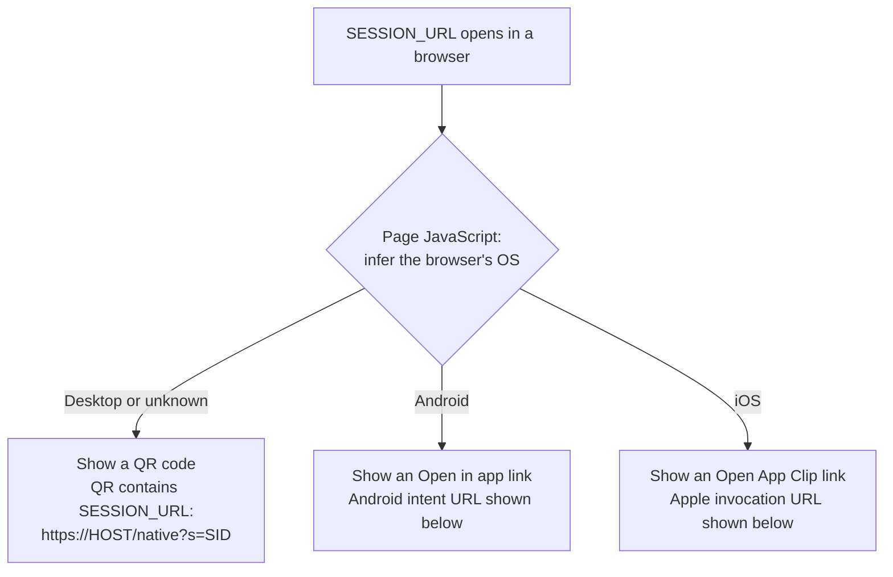
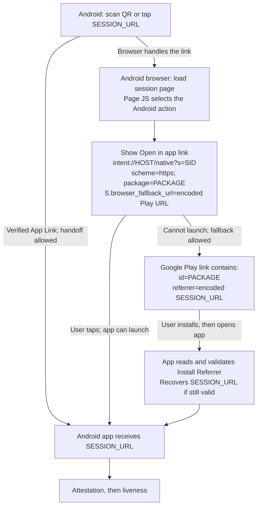
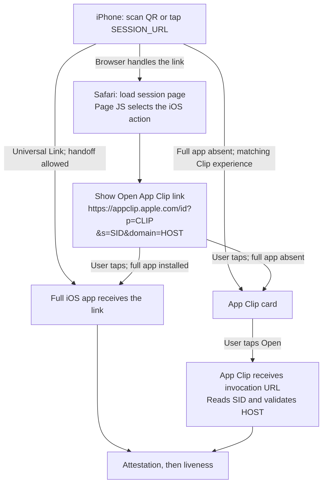

# How Web-to-Mobile Liveness Works

A user starts on your website, scans a QR code or taps a link, and completes
a liveness check in your Android app, iOS app, or iOS App Clip. Your backend
connects these steps using the same session ID. The liveness check assesses
whether a live person is in front of the camera.

This introduction explains the idea with examples. For implementation,
use the [integration quick start](README.md).


## 1. Links and QR Codes Carry Text

Consider the string `C:\Pictures\sample.jpg`. What happens depends on which
program receives it:

| Where You Pass the String | What Happens |
| --- | --- |
| `echo` or PowerShell's `Write-Output` | Prints the path. It does not open the file. |
| An image viewer | Opens that path, reads the file, and displays the image. |
| Notepad's file-open command | Reads the same file as text. A JPEG's binary contents usually look unreadable. |
| A command line inside Remote Desktop | Uses the remote computer's path. The file could be different or missing. |

The string does not become an image or unreadable text. The receiving program
chooses whether to print it, open a file, or do something else.

Try this in **Windows PowerShell**, replacing the path with an existing JPEG:

```powershell
$imagePath = 'C:\Pictures\sample.jpg'
Write-Output $imagePath
Start-Process -FilePath $imagePath
notepad.exe $imagePath
```

These commands print the path, open its default viewer, and open the file in
Notepad. Close Notepad without saving. In a remote session, the path refers
to the remote computer unless you explicitly use a shared or redirected drive.

The same idea applies to `https://liveness.example.com/native?s=...`:
a browser can request a web page, while an associated mobile app can read
the session ID and start its own workflow.

For this flow, a QR code encodes an HTTPS session link. When a phone's camera
app scans it, the code is decoded into that link string, equivalent to passing
the link directly to the camera app.

The camera app can recognize it as a link and offer to open it. When the user
taps, the phone's app-link and browser rules determine what opens next.

## 2. How the Phone Chooses App or Browser

For verified HTTPS-link handoff, an app declaring a URL is not enough.
**Android App Links** and **iOS Universal Links** establish a two-sided
association, like an allowlist:


| Platform | The App Declares | The Website Declares |
| --- | --- | --- |
| Android App Links | The HTTPS host and URL patterns it handles, in its manifest. | The allowed package name and signing-certificate fingerprint in `/.well-known/assetlinks.json`. |
| iOS Universal Links | The host in its signed Associated Domains entitlement. | The allowed app identifier and URL paths in `/.well-known/apple-app-site-association` (AASA). |

Android verifies the website's association against the installed app.
iOS verifies its association too, normally obtaining the AASA file through
Apple's content delivery network. **Universal Links do not require registering
each session URL with Apple.** App Clip experiences have additional App Store
Connect configuration, described below.

Both association files are hosted publicly over HTTPS without login or
redirects. Your app also validates the incoming host, path, and parameters
before using them.

This association answers **"Which app may open this link?"** It does not
replace your application's user authorization.

Installed apps can receive verified links directly, so the page may never be
loaded on the phone. However, camera apps, browser policies, user preferences,
and link context affect handoff. Typing a URL into a browser's address bar or
following a same-site link may stay in the browser even when the app is installed.
Test a real tap or scan and keep the fallback page usable.

See Google's [App Links explanation](https://developer.android.com/training/app-links/about)
and Apple's [associated domains explanation](https://developer.apple.com/documentation/xcode/supporting-associated-domains).

## 3. What the Website Displays

Serve a useful web page at the same HTTPS URL your apps handle. This is the
**fallback page**: it helps the user continue whenever the phone stays in
the browser.

The diagrams use `SESSION_URL` for `https://HOST/native?s=SID`. `HOST` is your
backend hostname, such as `liveness.example.com`, and `SID` is the same session
ID throughout. `PACKAGE` is the Android package name; `CLIP` is the App Clip
bundle ID. Optional callback parameters are omitted. None of these URLs
contains the Face session token.

When the page loads, JavaScript can infer the browser's OS from browser
information, such as `navigator.userAgent`, and choose which action to show:



This shows a **page-JavaScript design**. The current
[backend sample](backend/react/app/_lib/session_landing.ts) makes the platform
choice on the server using the HTTP `User-Agent` header, and also displays the
QR code on mobile pages. Either approach only selects the page's presentation;
it does not prove the OS, detect whether the app is installed, or attest the
device.


## 4. Android: From Link to Liveness

A QR scan supplies the HTTPS `SESSION_URL`. If it opens the website instead
of the app, the page offers a different link: an Android intent containing
the session URL's host, path, and query, the app package, and a Play fallback.
The following assumes a supporting browser and a configured Google Play URL.



In supporting browsers such as Chrome, a user tap on the `intent://` link
requests the named app. If the intent cannot be handled, the browser can
use the encoded fallback URL to go to Google Play.

The Play URL also carries a **referrer**: the original session link, encoded
as a query parameter. After installation, the user opens the app, and the app
reads that value through the Play Install Referrer API. It validates the link
and resumes the session if it is still valid. Installation alone does not
automatically start the liveness check.

Example **Open in app** link, using placeholder values:

```text
intent://liveness.example.com/native?s=11111111-2222-4333-8444-555555555555#Intent;scheme=https;package=com.example.liveness;S.browser_fallback_url=https%3A%2F%2Fplay.google.com%2Fstore%2Fapps%2Fdetails%3Fid%3Dcom.example.liveness%26referrer%3Dhttps%253A%252F%252Fliveness.example.com%252Fnative%253Fs%253D11111111-2222-4333-8444-555555555555;end
```

| Highlighted Part | Meaning |
| --- | --- |
| **`intent://`** | Identifies an Android intent link. |
| **`liveness.example.com/native`** | Backend hostname and app-opening path. |
| **`?s=...`** | The same session ID used by the website. |
| **`#Intent;`** and **`;end`** | Mark the start and end of the intent settings. |
| **`scheme=https`** | Makes the app's session URL use HTTPS. |
| **`package=com.example.liveness`** | Names the Android app to open. |
| **`S.browser_fallback_url=...`** | The encoded Google Play fallback URL; `S.` marks a string extra. |

Inside the decoded fallback, **`id=com.example.liveness`** selects the Play
listing and **`referrer=...`** carries the encoded original HTTPS session link.
Encode the session link inside the Play URL, then encode that complete Play
URL inside the intent. Both encoding layers are required.

The app must implement referrer recovery; App Links alone do not provide it.
Consume a recovered link once, reject expired sessions, and never put tokens
or credentials in the referrer. Test installation through Google Play.
Browser launch restrictions still apply, so use a user-tapped button, not a
timer or an assumed automatic redirect. See [Chrome's intent guidance](https://developer.chrome.com/docs/android/intents)
and the [sample's installation recovery](../samples/kotlin/face/AzureVisionLiveness/OVERVIEW.md#resume-after-google-play-installation).

## 5. iOS: From Link to Liveness

An **App Clip** is a small part of your iOS app that can run without installing
the full app. You build and publish it with its parent app and configure its
launch experience in App Store Connect.

The same QR contains `SESSION_URL`, not an Apple URL. A matching Universal
Link can open the installed full app. If the page opens in Safari, its
**Open App Clip** link instead contains Apple's invocation URL, the Clip
bundle ID, the session ID, and the backend host.

An iPhone without the full app can offer an App Clip from a QR code **only when
the URL is configured and recognized as an App Clip invocation**. An ordinary
Universal Link does not automatically download an App Clip. Otherwise, the
web page and its App Clip button provide the next step.



Safari can present an App Clip card; the user chooses to open it. iOS passes
the invocation URL to the Clip, which reads `s` and uses the allowlisted
`domain` as its backend. `appclip.apple.com` is the launch host, not your backend.
If the full app is installed, it handles the invocation instead and must
support the same flow.

For the Safari button, use the generated **default App Clip link**, which can
carry query parameters. A default link for this example looks like:

```text
https://appclip.apple.com/id?p=com.example.liveness.Clip
```

With a placeholder session ID and backend host, it looks like:

```text
https://appclip.apple.com/id?p=com.example.liveness.Clip&s=11111111-2222-4333-8444-555555555555&domain=liveness.example.com
```

| Highlighted Part | Meaning |
| --- | --- |
| **`https://appclip.apple.com/id`** | Apple's HTTPS App Clip launch endpoint, not your backend. |
| **`?p=com.example.liveness.Clip`** | Identifies the App Clip by its bundle ID. |
| **`&s=...`** | The same session ID used by the website. |
| **`&domain=liveness.example.com`** | The backend hostname the Clip validates before use. |

Public links require a released, approved App Clip experience. Demo links
cannot carry these session parameters. A custom-domain QR invocation also
requires the matching website association and App Clip experience; creating
the URL string alone does not configure any of this. See Apple's
[App Clip experiences guide](https://developer.apple.com/documentation/appclip/configuring-the-launch-experience-of-your-app-clip)
and the [App Clip integration steps](README.md#52-use-an-app-clip).

## 6. After Handoff: Attestation and Liveness

**Device attestation** helps check that the phone's software has not been
tampered with and that the app is genuine and unmodified. These checks use
security evidence from Android or iOS and depend on the platform and your
backend's security policy.

After those checks pass, the attestation libraries use the verified app
identity to establish an **encrypted session between the app and backend**.
Messages carrying the Face session token and liveness digest are encrypted,
so other apps or anyone intercepting those messages cannot read their contents
without the required encryption keys. This encryption protects the token and
digest messages exchanged by the attestation libraries; it does not change
how the app's other traffic is handled.


The flow has three stages:

| Stage | What Happens |
| --- | --- |
| **1. Attest** | The backend checks the app and phone, then releases the encrypted Face token. |
| **2. Run liveness** | The Face UI runs the check. The app sends its digest (a fingerprint of the submitted data) through the same attestation session. |
| **3. Check the result** | The backend retrieves the Face result for that session and requires a non-empty, matching digest before using the liveness decision. |

Together, these checks link the Face result to the verified app's submission.
Your backend uses the result's liveness decision to determine whether the
check passed. Your flow can then continue in the app or return the user to
the browser.

See the [full session pipeline](README.md#session-pipeline) for the detailed
sequence.

## Next: Integrate It

Start with the [integration roadmap](README.md#integration-roadmap) for library
setup, platform configuration, and verification. The sample's
[landing-page implementation](backend/react/app/_lib/session_landing.ts) shows
how it builds the QR URL and platform buttons; the [backend overview](OVERVIEW.md)
covers architecture and configuration in more depth.