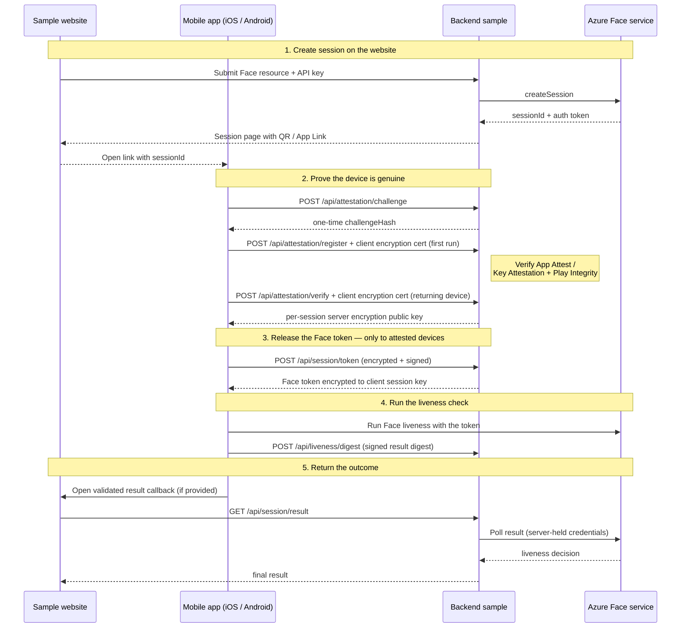
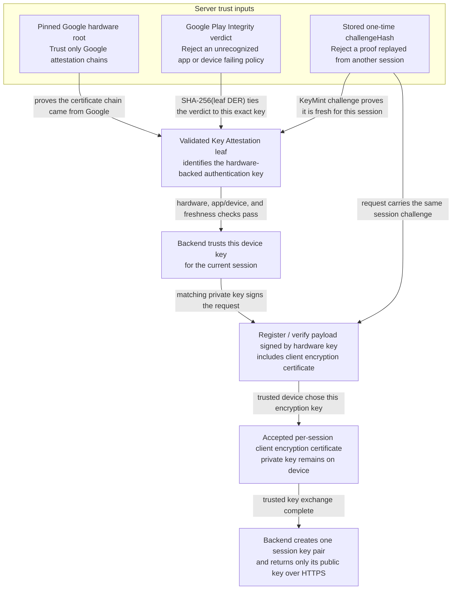
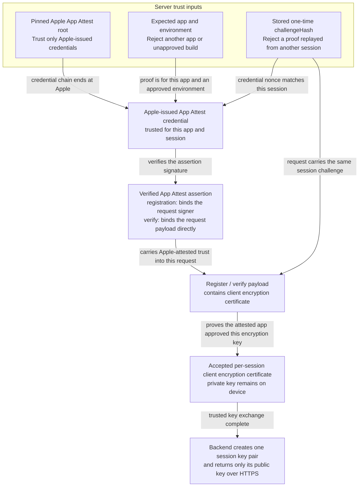

# Azure AI Vision Face — Liveness Attestation Backend Samples

These samples show how to build the **server side** of the Azure AI Vision Face
liveness *device-attestation* flow. The backend sits between a native mobile
client (iOS / Android) and the Azure Face service, and its job is to release a
Face liveness session token **only to a genuine, attested app instance**, then
relay the final liveness result back to the browser.

The same backend is implemented in .NET, Java, Python, and Node.js, each
pairing a small, framework-agnostic attestation library with a runnable web
sample. All four share the same endpoints, wire protocol, and flow, allowing
you to adopt whichever stack best fits your environment.

## The four languages

| Language | Framework | Sample | Reusable library |
| --- | --- | --- | --- |
| **.NET (C#)** | ASP.NET Core | [`backend/dotnet`](backend/dotnet) | [`library/dotnet`](library/dotnet/AzureAIVisionFaceDeviceAttestation) |
| **Java** | Spring Boot (Java 17) | [`backend/java`](backend/java) | [`library/java`](library/java/AzureAIVisionFaceDeviceAttestation) |
| **Python** | FastAPI | [`backend/python`](backend/python) | [`library/python`](library/python/AzureAIVisionFaceDeviceAttestation) |
| **Node.js** | Next.js (TypeScript, React) | [`backend/react`](backend/react) | [`library/javascript`](library/javascript/AzureAIVisionFaceDeviceAttestation) |

Each library is **framework-agnostic** (no web framework coupling),
**environment-free** (reads no environment variables), **storage-agnostic** (you
inject a `ClusterStore`), and **telemetry-injected** (you inject a logger). The
sample is the thin host that wires the library to a web framework, a store
(Redis or in-memory), configuration, and telemetry.

## Repository layout

```
backend_samples/
├── backend/                # Four runnable web samples (the host apps)
│   ├── dotnet/             #   ASP.NET Core
│   ├── java/               #   Spring Boot
│   ├── python/             #   FastAPI
│   ├── react/              #   Next.js
│   └── pom.xml             #   Maven aggregator (builds Java library + sample)
└── library/                # The reusable attestation library, one per language
    ├── dotnet/
    ├── java/
    ├── javascript/
    └── python/
```

## Basic flow

The backend brokers trust between the mobile client SDK and the Azure Face
service. A device must prove it is a genuine, unmodified app instance (via
**App Attest** on iOS, **Key Attestation + Play Integrity** on Android) before
the backend will hand out a Face liveness session token.



Step by step:

1. **Create session** — on the sample website, the user enters the Face resource
   and API key to start a liveness session. The backend calls the Face service's
   `createSession`, keeps the credentials and auth token **server-side only**,
   and shows a QR code or App Link containing only the session ID.
2. **Challenge** — `POST /api/attestation/challenge` returns a one-time
   `challengeHash` that binds the following attestation to this session.
3. **Register / Verify** — on first run the device sends full hardware
   attestation to `POST /api/attestation/register`; a returning device uses the
   cheaper `POST /api/attestation/verify`. The backend validates the attestation
   and stores the device's public certificate.
4. **Session token** — `POST /api/session/token` releases the **encrypted** Face
   liveness token, but only to a device that passed attestation.
5. **Liveness digest** — after running the Face liveness check, the client
   submits a signed/encrypted digest to `POST /api/liveness/digest`.
6. **Result** — the app opens the validated result callback in the browser when
   one is provided. The browser polls `GET /api/session/result`; the backend
   queries the Azure Face service with the server-held credentials and returns
   the final liveness decision to the browser. The Face subscription key is not
   sent to the mobile app and is used only for server-side
   session creation and result polling.

### How attestation establishes trust

The protocol binds four things together: the backend session, a hardware-backed
device key, the genuine app identity, and each request that can release or
submit liveness data.

**Android trust chain**



**iOS trust chain**



#### One-time challenge

The challenge endpoint derives a 32-byte `challengeHash` from fresh random data,
stores it with the session, client ID, and platform, and returns it once. The
client must use those exact challenge bytes in its platform attestation. The
backend rejects an attestation whose embedded challenge does not match the
stored value, preventing a proof from another session from being replayed.

#### Android registration

The app creates a hardware-backed Android Keystore signing key with the
`challengeHash` as the Key Attestation challenge. Android places it in the leaf
certificate's KeyMint/Keymaster attestation extension. Registration sends that
certificate, its hardware attestation chain, and a Play Integrity token. The
registration payload is also signed with the corresponding private key to prove
key possession.

The backend requires the authentication certificate to be the attestation
chain's leaf, checks the embedded challenge, and validates every chain signature
to a pinned Google Hardware Attestation root. Root pinning establishes that the
chain came from Google's hardware-attestation PKI; otherwise an attacker could
create a root and claim that a software key is hardware-backed.

The backend also requires the Play Integrity `requestHash` to equal
`hex(SHA-256(authentication certificate DER))`. This binds Google's recognized
app and device-integrity verdict to that exact certificate. Without the match,
a valid Play Integrity token from another key or registration could be paired
with the presented certificate. Certificate validity and revocation are checked
as well.

#### iOS registration

The app passes the `challengeHash` to App Attest as the `clientDataHash`. The
backend validates the chain to the pinned Apple App Attest root, preventing an
attacker from supplying its own root and credential. It also checks that the
`rpIdHash` identifies the configured `IOS_APP_ID` (`AppSettings__IosAppId` on
.NET), that the AAGUID passes the production/development policy, and that the
credential certificate contains the expected nonce:

`SHA-256(authenticatorData || challengeHash bytes)`

The nonce binds the Apple credential to this session and prevents replay. The
request-signing certificate is a separate Secure Enclave certificate; it is not
directly issued or attested by Apple. The app therefore creates an App Attest
assertion over its hash. Verifying that assertion with the Apple credential
binds the exact request-signing key to the attested app and prevents another
key from being substituted. The attestation and assertion are sent together in
the registration call.

#### Signed authenticated calls

Android signs each authenticated request (`register`, `verify`, `token`, and
`digest`) with its hardware-attested authentication key. The backend first
verifies the certificate chain and that the Play Integrity token is bound to
the same certificate, then trusts signatures from that key.

iOS signs the same requests with its registered device authentication key.
Registration uses an App Attest assertion to bind that key to the
Apple-attested key; later `verify`, `token`, and `digest` calls include fresh
assertions, keeping the Apple attestation proof attached to each request.

#### Per-session encryption

During registration or returning-device verification, the device generates a
fresh P-256 encryption key pair and sends its short-lived public certificate
inside the authentication-key-signed payload. The backend accepts it only after
the attestation proof passes, then generates one P-256 key pair for the session
and returns its public key over HTTPS. Neither private key crosses the network.

For token and digest calls, the device encrypts the payload to the server key
with Tink-compatible ECIES (P-256 ECDH, HKDF-SHA-256, and AES-256-GCM), then
signs the ciphertext with its authentication key. iOS also adds a fresh App
Attest assertion over the same bytes. The backend verifies these proofs before
decrypting, and encrypts its response to the device's ephemeral public key so
only that device can read the Face token or digest acknowledgement.

In the normal successful flow, each recipient public key is used exactly twice:
the server key encrypts the token and digest requests, while the device
certificate's key encrypts the token response and digest acknowledgement. That
is **two encrypted API calls and four ciphertexts per session**. Each ECIES
ciphertext also uses a fresh per-message sender key.

The recipient keys are single-session, not single-message. The client destroys
its ephemeral key after the digest or when the session is replaced, while the
backend key expires with session state. This payload encryption complements,
rather than replaces, HTTPS.

### Shared API surface

Every sample exposes the same endpoints:

| Endpoint | Method | Purpose |
| --- | --- | --- |
| `/api/attestation/challenge` | POST | Issue a one-time attestation nonce |
| `/api/attestation/register` | POST | First-run device attestation (App Attest / Key Attestation + Play Integrity) |
| `/api/attestation/verify` | POST | Returning-device attestation check |
| `/api/session/token` | POST | Release the encrypted Face liveness token to an attested device |
| `/api/liveness/digest` | POST | Accept the signed liveness result digest from the device |
| `/api/session/result` | GET | Poll the Face service and return the final decision |
| `/.well-known/apple-app-site-association` | GET | iOS Universal Link binding (generated from config) |
| `/.well-known/assetlinks.json` | GET | Android App Link binding (generated from config) |
| `/healthz` | GET | Health probe |

## Mobile apps and backend binding

Every backend works with both AzureLiveness mobile apps through the matching
[device-attestation client library](../client_libraries/OVERVIEW.md):

| Platform | Mobile app | Backend host configuration in the app |
| --- | --- | --- |
| **Android** | [`AzureLiveness` Android app](../samples/kotlin/face/AzureVisionLiveness/OVERVIEW.md) | Set `LIVENESS_HOST` or the Gradle `livenessHost` property; the build adds an HTTPS `autoVerify` intent filter for that host and `/native` |
| **iOS** | [`AzureLiveness` iOS app](../samples/swift/face/AzureVisionLiveness/OVERVIEW.md) | Set `LIVENESS_HOST` in [`AzureVisionLiveness.xcconfig`](../samples/swift/face/AzureVisionLiveness/AzureVisionLiveness.xcconfig); the build signs `applinks:<host>` into the app's associated-domains entitlement |

App Links and Universal Links bind a signed app to a backend's HTTPS domain by
making both sides name each other:

1. **The app names the backend.** Android declares the backend host and
   `/native` path in an `android:autoVerify="true"` intent filter. iOS declares
   `applinks:<host>`; its App Clip also declares `appclips:<host>`.
2. **The backend names the app.** Set `ANDROID_PACKAGE_NAME` and
   `ANDROID_SHA256_CERT_FINGERPRINTS` for Android. Set `IOS_APPLINK_APP_ID`
   (`TeamID.BundleID`) for iOS, or let it fall back to `IOS_APP_ID`; set
   `IOS_APP_CLIP_ID` when using the App Clip. The backend generates the two
   association documents from these values. For .NET, use the equivalent
   environment-variable names in [Configuration](#configuration).
3. **The operating system verifies both claims.** Android fetches
   `https://<host>/.well-known/assetlinks.json` and matches its package name and
   signing-certificate fingerprints. iOS fetches
   `https://<host>/.well-known/apple-app-site-association` and matches the app
   ID and `APPLINK_PATH` (default `/native*`). The files must be publicly
   available over HTTPS on the same host configured in the app.
4. **The verified link starts the mobile flow.** After creating and storing a
   Face session, the backend produces `https://<host>/native?s=<session-id>`;
   the QR code also carries a browser result callback. The OS opens the verified
   AzureLiveness app, which validates the host against its build-time allowlist,
   reads the session ID, and calls the attestation endpoints on that same
   backend. The Face session token never appears in the link and remains
   server-side until attestation succeeds.

If the app is not installed or the association cannot be verified, the HTTPS
URL stays in the browser and the backend serves its fallback landing page. Link
association controls URL routing; App Attest on iOS and Key Attestation plus
Play Integrity on Android separately establish device and app integrity.

## Configuration

The sample hosts load settings and pass an `AttestationConfig` object to the
library at initialization. The library itself does not read environment
variables. Python, Java, and Node.js samples use the names in the first column
below. .NET binds its `AppSettings` configuration section using the
`AppSettings__...` names in the second column; it does not read the corresponding
bare names. The sample index pages show whether the most important settings are
configured.

See each backend's configuration file for the complete list and defaults:

- **.NET**: [`appsettings.json`](backend/dotnet/appsettings.json), under `AppSettings`.
- **Java**: [`application.yml`](backend/java/src/main/resources/application.yml).
- **Python**: [`.env.example`](backend/python/.env.example).
- **Node.js**: [`.env.example`](backend/react/.env.example).

Only Python and Node.js provide `.env.example` files.

The library field names below use Java/TypeScript spelling. .NET and Python
use their language-specific `AttestationConfig` names.

| Python / Java / Node.js variable | .NET environment variable | Library Field (Java/TypeScript) | Purpose |
| --- | --- | --- | --- |
| `IOS_APP_ID` | `AppSettings__IosAppId` | `iosAppId` | iOS App Attest identity (`AppIDPrefix.BundleID`) |
| `IOS_APP_CLIP_ID` | `AppSettings__IosAppClipId` | `iosAppClipId` | iOS App Clip ID published in the AASA file |
| `IOS_APPLINK_APP_ID` | `AppSettings__IosApplinkAppId` | `iosApplinkAppId` | iOS Universal Link identity (falls back to the App Attest identity) |
| `ANDROID_PACKAGE_NAME` | `AppSettings__AndroidPackageName` | `androidPackageName` | Android package for Play Integrity + App Links |
| `ANDROID_SHA256_CERT_FINGERPRINTS` | `AppSettings__AndroidSha256CertFingerprints` | `androidSha256CertFingerprints` | App Link certificate fingerprints |
| `GOOGLE_SERVICE_ACCOUNT_JSON` | `AppSettings__GoogleServiceAccountJson` | `googleServiceAccountJson` | Play Integrity API credentials (secret) |
| `APPLINK_PATH` | `AppSettings__ApplinkPath` | `applinkPath` | AASA launch-path matching pattern |
| `DEBUG_MODE` | `AppSettings__DebugMode` | `debugMode` | Loosens attestation policy for development builds |
| `ALLOW_DEVICE_INTEGRITY` | `AppSettings__AllowDeviceIntegrity` | `allowDeviceIntegrity` | Allow the weaker Android device-integrity verdict |
| `ALLOW_BASIC_INTEGRITY` | `AppSettings__AllowBasicIntegrity` | `allowBasicIntegrity` | Allow the weaker Android basic-integrity verdict |
| `ALLOW_ANDROID_ATTESTATION_WHEN_GOOGLE_UNAVAILABLE` | `AppSettings__AllowAndroidAttestationWhenGoogleUnavailable` | `allowAndroidAttestationWhenGoogleUnavailable` | Allow hardware Key Attestation alone when Play Integrity is unavailable |
| `IOS_APP_STORE_URL` | `AppSettings__IosAppStoreUrl` | Host only | iOS store or App Clip link shown on the session landing page |
| `ANDROID_PLAY_STORE_URL` | `AppSettings__AndroidPlayStoreUrl` | Host only | Android store link shown on the session landing page |

The store URLs are not `AttestationConfig` fields. Your website/backend owns
link generation and supplies these URLs independently of the library.

### Sample Environment Examples

These are host settings, not library initialization parameters. Replace the
example identities and certificate fingerprint with your signed app's values;
use the .NET equivalents above when running that sample.

```dotenv
ANDROID_PACKAGE_NAME=com.example.liveness
ANDROID_SHA256_CERT_FINGERPRINTS=<colon-separated-signing-certificate-sha256>
IOS_APP_ID=ABCDE12345.com.example.liveness
IOS_APPLINK_APP_ID=ABCDE12345.com.example.liveness
APPLINK_PATH=/native*
IOS_APP_CLIP_ID=ABCDE12345.com.example.liveness.Clip
IOS_APP_STORE_URL=https://appclip.apple.com/id?p=com.example.liveness.Clip
ANDROID_PLAY_STORE_URL=https://play.google.com/store/apps/details?id=com.example.liveness
DEBUG_MODE=false
```

The App Clip settings are needed only for that optional flow. Supply
`GOOGLE_SERVICE_ACCOUNT_JSON` securely through the host's secret configuration;
never commit the downloaded private key. Restart the sample host after
changing its environment settings.

### Local Development Policy

The backend configuration flag is `DebugMode` (.NET), `debugMode` (Java and
Node.js/TypeScript), or `debug_mode` (Python). It is not a mobile `initialize`
parameter and is not inferred from the app's Debug build configuration.
The sample hosts populate it from `DEBUG_MODE=true`
(`AppSettings__DebugMode=true` on .NET).

- **Android:** Accepts `UNRECOGNIZED_VERSION` for sideloaded builds and
   `MEETS_DEVICE_INTEGRITY` or `MEETS_BASIC_INTEGRITY` instead of requiring
   `MEETS_STRONG_INTEGRITY`. A valid Play Integrity token, a matching package
   name, and hardware-backed key attestation are still required. For App Links,
   use the locally installed APK's signing-certificate fingerprint.
- **iOS:** Accepts App Attest's `development` environment for locally installed
   Xcode builds. App signing, a supported physical device, and the matching
   app identifier in the backend configuration are still required.

This flag relaxes policy; it does not disable attestation. Keep it false in
production and use production policy for final store-build verification.

### Custom Launch Paths

`/native` is the sample website's launch route, not a library requirement.
To use `/liveness`, update the backend page, redirects, and generated links;
set Android's `android:pathPrefix="/liveness"`; and set `applinkPath` to
`/liveness*` in the backend configuration (`APPLINK_PATH=/liveness*` in the
sample hosts). Update app path checks and custom-domain App Clip experiences
to match.

`applinkPath` changes AASA matching only; it does not rename backend routes.
This is separate from `DeviceAttestationEndpoints`, which configures the
attestation API paths. The two `/.well-known/...` association URLs remain
fixed and publicly accessible without authentication or redirects.

## Bicep deployment

Each backend contains the same modular template set under its
`deployment/bicep/` folder:

| Template | Purpose |
| --- | --- |
| `main.bicep` | Subscription-scope entry point that creates the resource group |
| `resource-group.bicep` | Coordinates resource creation inside the resource group |
| `app-service.bicep` | Creates the Linux App Service plan, web app, and managed identity |
| `redis.bicep` | Creates Azure Managed Redis and grants the web app identity access |
| `app-settings.bicep` | Configures Redis, attestation, App Link, and runtime settings |

| Backend | Bicep folder | Parameters | Deployment scripts |
| --- | --- | --- | --- |
| **.NET** | [`backend/dotnet/deployment/bicep`](backend/dotnet/deployment/bicep) | [`main.parameters.json`](backend/dotnet/deployment/main.parameters.json) | [`deploy.ps1`](backend/dotnet/deployment/deploy.ps1) / [`deploy.sh`](backend/dotnet/deployment/deploy.sh) |
| **Java** | [`backend/java/deployment/bicep`](backend/java/deployment/bicep) | [`main.parameters.json`](backend/java/deployment/main.parameters.json) | [`deploy.ps1`](backend/java/deployment/deploy.ps1) / [`deploy.sh`](backend/java/deployment/deploy.sh) |
| **Python** | [`backend/python/deployment/bicep`](backend/python/deployment/bicep) | [`main.parameters.json`](backend/python/deployment/main.parameters.json) | [`deploy.ps1`](backend/python/deployment/deploy.ps1) / [`deploy.sh`](backend/python/deployment/deploy.sh) |
| **Node.js** | [`backend/react/deployment/bicep`](backend/react/deployment/bicep) | [`main.parameters.json`](backend/react/deployment/main.parameters.json) | [`deploy.ps1`](backend/react/deployment/deploy.ps1) / [`deploy.sh`](backend/react/deployment/deploy.sh) |

The scripts provision the infrastructure, build the selected backend, and
deploy it to App Service. Secrets such as `GOOGLE_SERVICE_ACCOUNT_JSON`
(`AppSettings__GoogleServiceAccountJson` on .NET) are intentionally not stored
in the Bicep templates and must be configured securely after deployment.

## Security notes

- These samples ship a policy suitable for evaluation. Review the attestation
  policy, certificate-to-user association, and store implementation before
  production use.
- The Face session **token** is released only to an attested device and is
  **encrypted end-to-end** to that device's key, so it is never exposed in the
  clear; a browser/QR landing page only ever sees the final liveness decision.
