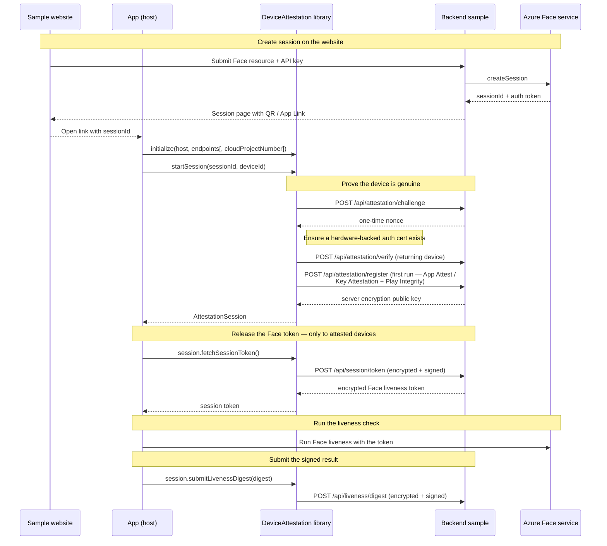

# Azure AI Vision Face — Liveness Attestation Client Libraries

These libraries implement the **client (device) side** of the Azure AI Vision
Face liveness *device-attestation* flow. They are the mobile counterpart of the
[backend samples](../backend_samples/OVERVIEW.md): the backend releases a Face liveness
session token **only to a genuine, attested app instance**, and these libraries
are what prove the device is genuine and then drive the encrypted token/digest
exchange from the app.

Each library proves the app is a real, unmodified instance using the platform's
hardware attestation — **App Attest** on iOS, **Key Attestation + Play
Integrity** on Android — and speaks the same wire protocol as every backend
sample, so either platform works against any of the .NET, Java, Python, or
Node.js backends.

## The two platforms

| Platform | Language | Packaging | Library | Sample app |
| --- | --- | --- | --- | --- |
| **Android** | Kotlin | Gradle library module (`com.android.library`) | [`android/AzureAIVisionFaceDeviceAttestation`](android/AzureAIVisionFaceDeviceAttestation) | [`AzureLiveness`](../samples/kotlin/face/AzureVisionLiveness/OVERVIEW.md) |
| **iOS** | Swift | Swift Package (SPM) | [`ios/AzureAIVisionFaceDeviceAttestation`](ios/AzureAIVisionFaceDeviceAttestation) | [`AzureLiveness`](../samples/swift/face/AzureVisionLiveness/OVERVIEW.md) |

Both libraries expose the **same interface** — a `DeviceAttestation` entry point
that runs the attestation flow and hands back an `AttestationSession` that owns
the per-session secrets and performs the token exchange and liveness-digest
submission. They are **host-agnostic**: the app supplies the liveness host,
endpoint paths, and (on Android) the Play Integrity cloud project number, so the
libraries carry no build-time coupling to any particular app.

## Requirements

| Platform | Minimum | Build tools | Key dependencies |
| --- | --- | --- | --- |
| **Android** | `minSdk 31` (Android 12), `compileSdk 36` | Gradle, Android Gradle Plugin, Java 8 source compatibility | `kotlinx-coroutines`, Play Integrity API, Google Tink |
| **iOS** | iOS 15 | Xcode 15, Swift tools 5.9 | System frameworks only — CryptoKit, DeviceCheck, Security |

The iOS library requires no third-party dependencies. The Android library pulls
its dependencies from Google and Maven Central (see
[`build.gradle`](android/AzureAIVisionFaceDeviceAttestation/build.gradle)).

## Repository layout

```
client_libraries/
├── android/
│   └── AzureAIVisionFaceDeviceAttestation/   # Gradle library module
│       ├── build.gradle                      #   namespace com.azure.android.ai.vision.face.deviceattestation
│       ├── settings.gradle                   #   root project azure-ai-vision-face-deviceattestation
│       └── src/main/java/.../deviceattestation/
│           ├── DeviceAttestation.kt          #   public entry point (initialize / startSession)
│           ├── AttestationSession.kt         #   per-session token + digest calls
│           ├── AttestationFlow.kt            #   challenge → verify → register glue
│           ├── CertificateManager.kt         #   hardware-backed auth cert (AndroidKeyStore)
│           ├── PlayIntegrityTokenProvider.kt #   Play Integrity token
│           └── …                             #   crypto / HTTP / endpoint helpers
└── ios/
    └── AzureAIVisionFaceDeviceAttestation/   # Swift package
        ├── Package.swift                     #   product/target AzureAIVisionFaceDeviceAttestation
        └── Sources/AzureAIVisionFaceDeviceAttestation/
            ├── DeviceAttestation.swift       #   public entry point (initialize / startSession)
            ├── AttestationSession.swift      #   per-session token + digest calls
            ├── AppAttestManager.swift        #   App Attest key + assertions
            ├── CertificateManager*.swift     #   Secure-Enclave auth cert (Keychain)
            └── …                             #   crypto / HTTP / endpoint helpers
```

## The attestation flow (client side)

The flow starts on the backend sample website, where the user creates a Face
liveness session. The backend keeps the resulting auth token server-side, and
the app opens from a deep link (an iOS **Universal Link** / Android **App Link**)
that carries only the session id. The client library then handles the hardware
attestation, cert management, ECIES encryption, and ECDSA signing; the app only
supplies configuration and reacts to the result.



Step by step:

1. **Initialize** — the app supplies the liveness host and endpoint paths (plus
   the Play Integrity cloud project number on Android). This warms up Play
   Integrity on Android so the first round trip is fast.
2. **Start session** — `startSession` fetches a one-time challenge, ensures a
   hardware-backed auth certificate exists (**Secure Enclave** on iOS,
   **AndroidKeyStore** on Android), then either **verifies** a returning device
   or **registers** a first-run device with full hardware attestation. On
   success it returns an `AttestationSession`.
3. **Session token** — `fetchSessionToken` sends an encrypted, signed request
  and decrypts the **Face liveness token**. Both platforms authenticate the
  request with the registered auth-cert ECDSA signature. iOS additionally
  includes a fresh App Attest assertion over the encrypted request. Full
  registration attestation is not repeated here.
4. **Liveness digest** — after the Face liveness UI runs, `submitLivenessDigest`
  sends the encrypted, signed result digest, with another fresh App Attest
  assertion on iOS. This is the final call: the session's
   ephemeral encryption key is wiped and the session is released automatically.

### Endpoints

The libraries call the same endpoints as every backend sample. Defaults match
the reference backend and can be overridden at `initialize` time:

| Endpoint | Method | Purpose |
| --- | --- | --- |
| `api/attestation/challenge` | POST | Fetch a one-time attestation nonce |
| `api/attestation/verify` | POST | Returning-device attestation check |
| `api/attestation/register` | POST | First-run device attestation |
| `api/session/token` | POST | Retrieve the encrypted Face liveness token |
| `api/liveness/digest` | POST | Submit the signed liveness result digest |

## Public API

Both platforms expose one static/shared entry point plus a per-session object.
Instances of `AttestationSession` are created only by the library; there is a
single active session at a time, re-resolvable via `currentSession()`.

### Android (Kotlin)

```kotlin
// 1. Configure once (host + endpoints + Play Integrity project number).
DeviceAttestation.initialize(
    context = context,
    livenessHost = livenessHost,
    cloudProjectNumber = BuildConfig.CLOUD_PROJECT_NUMBER,
    endpoints = DeviceAttestationEndpoints() // defaults shown above
)

// 2. Run the full attestation flow.
when (val start = DeviceAttestation.startSession(context, sessionId, deviceId)) {
    is DeviceAttestation.StartSessionResult.Success -> {
        val session = start.session

        // 3. Exchange for an encrypted Face liveness token.
        when (val token = session.fetchSessionToken()) {
            is AttestationSession.SessionTokenResult.Success -> { /* run liveness */ }
            is AttestationSession.SessionTokenResult.Error -> { /* token.code / token.message */ }
            is AttestationSession.SessionTokenResult.Exception -> { /* token.exception */ }
        }
    }
    is DeviceAttestation.StartSessionResult.Error -> { /* start.code / start.message */ }
    is DeviceAttestation.StartSessionResult.Exception -> { /* start.exception */ }
}

// 4. After the liveness UI runs, submit the signed digest (auto-releases the session).
DeviceAttestation.currentSession()?.submitLivenessDigest(digest)
```

### iOS (Swift)

```swift
// 1. Configure once (host + endpoints).
await DeviceAttestation.shared.initialize(livenessHost: livenessHost)

// 2. Run the full attestation flow.
switch await DeviceAttestation.shared.startSession(
    sessionId: sessionId,
    clientId: clientId,
    deviceUUID: deviceUUID
) {
case .success(let session):
    // 3. Exchange for an encrypted Face liveness token.
    switch await session.fetchSessionToken() {
    case .success(let token): break // run liveness
    case .error(let code, let message): break
    case .exception(let error): break
    }
case .error(let code, let message): break
case .exception(let error): break
}

// 4. After the liveness UI runs, submit the signed digest (auto-releases the session).
_ = await DeviceAttestation.shared.currentSession()?.submitLivenessDigest(digest)
```

See the [iOS sample app overview](../samples/swift/face/AzureVisionLiveness/OVERVIEW.md)
for backend-host, Universal Link, and App Clip configuration.

## Using the libraries in an app

Both libraries are consumed as **local, source-level dependencies** by the Face
liveness sample apps in [`../samples`](../samples):

- **Android** — the sample includes the module by relative path in its
  `settings.gradle.kts` and depends on it as
  `implementation(project(":azure-ai-vision-face-deviceattestation"))`. See
  the [`AzureLiveness` Android app](../samples/kotlin/face/AzureVisionLiveness/OVERVIEW.md).
- **iOS** — the sample adds this directory as a local Swift package dependency
  and links the `AzureAIVisionFaceDeviceAttestation` product to the app (and App
  Clip) target. See
  the [`AzureLiveness` iOS app](../samples/swift/face/AzureVisionLiveness/OVERVIEW.md).

## Security notes

- **Keys never leave the device.** The auth signing key is generated in and
  bound to hardware (Secure Enclave / AndroidKeyStore) and is non-exportable.
  Only public certificates and signatures go over the wire.
- **Per-session secrets are private.** The `challengeHash`, server encryption
  public key, and the client's ephemeral encryption private key are owned by the
  `AttestationSession` and never exposed through the public API. The ephemeral
  key is wiped automatically once the liveness digest is submitted.
- **Requests are encrypted and signed.** Token and digest payloads are ECIES
  encrypted to the server's public key and ECDSA signed with the auth key, so
  the backend can both authenticate the device and keep the Face token
  confidential in transit.