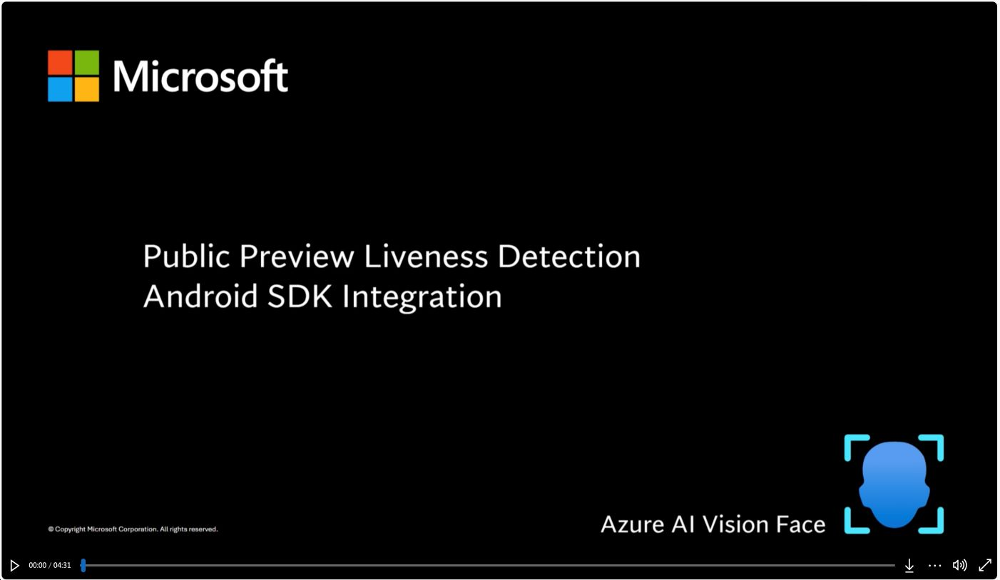

# Get started with the Azure AI Vision Face Client SDK for Android (Preview)

In this sample, you will learn basic design patterns for face recognition with liveness detection using the Azure AI Vision Face Client SDK for Android (Preview). The SDK is currently in preview and APIs are subject to change.

## Prerequisites 
* An Azure Face API resource subscription.
* A PC (Windows, Linux, Mac) with Android Studio installed.
* An Android mobile device (API level 21 or higher).

 Now you can either:
 
- [Build and run sample app](#build-the-sample-app) 
- [Integrate face analysis into your own application](#integrate-face-analysis-into-your-own-application)

## Build and run sample app
The sample app uses the Vision SDK to perform face liveness analysis. The following sections will walk you through these building and running the sample.

### Get Access Token to SDK Artifact
The access token is used for maven authentication.  The solution uses azure maven repo artifact to add the binary enabling the liveness feature.  You will need to set up azure maven repo with any username and valid "access token" as "password".  This token will be used as `mavenPassword` in the [Add Build Dependency](#step-5-add-build-dependency) section below.
See [GET_FACE_ARTIFACTS_ACCESS](../../../../GET_FACE_ARTIFACTS_ACCESS.md).

### Add Credential
You need to add credentials in `gradle.properties` to set up variable `mavenUser` and `mavenPassword` used above.  These are obtained through azure command in sdk access.  `mavenPassword` is the access token from above section.  
The creditial is going to look like:
```
mavenUser=any_username_string
mavenPassword=access_token
```

### Build the sample app
Follow these steps to try out the sample app. The app performs liveness analysis using the Vision SDK.
* Open the "FaceAnalyzerSample" folder on Android Studio.
* Press Ctrl+F9, or select **Build** \> **Make Project**.

### Run the sample
Follow these steps to download and launch the app on your Android device.
* Your android device must be in developer mode with USB debugging enabled.
* Check that your device has a network connection.
* Connect your device to your development PC.
* Make sure Android Studio recognizes the device. Go to Device Manager in Android Studio, click on the “Physical” tab, and check that your device listed. The app cannot run on an emulator because camera input is needed. 
* Press Shift+F10 or select **Run** \> **Run 'app'**.
* Once the app is installed on the phone, it will ask for camera and storage permissions. Allow these two permissions. 
* Click on the "Settings" button on the main page. Enter in your Face API endpoint and subscription key. Click “Save” if you made any changes.  
* You are now ready to run the app. Click each button to run through each scenario, like liveness and livenessWithVerify.

### Verification with liveness analysis

Verification is a 1-1 matching. You can verify against a face, like the photo on your ID card. 

1. Using your device's camera, take a photo of your ID card. Make sure your face is in the upright position and has not been rotated.
2. Click on the "Select Verify Image" button and it will prompt you to upload an image of a face to verify against. Upload the image of your ID card.
3. Click on the "LivenessWithVerify" button.
4. Click next and show your face to the front-facing camera. As it processes your images, the screen will display user feedback on image quality. The screen will also flash black and white. This is needed for liveness analysis. 
5. Once your face is analyzed, the app will display your verification and liveness results. You should expect a "recognized" and a "live" result. A recognition confidence score is also displayed. 

To test out other liveness analysis scenarios, repeat steps 1-5, this time holding up your ID card to the front-facing camera. Since this is not a live face, you should expect a "recognized" and a "spoof" result. 


## Integrate face analysis into your own application

Here are the recommended steps you should consider to follow during your integration. Also, here is an companion video that shows **[how to do the integration in an Android Empty Actitivy project](https://aka.ms/azure-ai-vision-face-liveness-client-sdk-android-integration-video)**.

[](https://aka.ms/azure-ai-vision-face-liveness-client-sdk-android-integration-video)

### The overview of face recognition with liveness detection in Azure AI Vision SDK for Android (Preview)
Here is the outline of the SDK sample and integration structure
1. The solution uses azure maven repo artifact to add the binary enabling the liveness feature.  You will need to set up azure `maven` repo with any `username` and valid "access token" as "password.  It will be mentioned below in [Get Access Token to SDK Artifact](#step-4-get-access-token-to-sdk-artifact) section for getting the password, along with the [Add Build Dependencies](#step-5-add-build-dependency) to set the repo in the solution files.
2. The app requires camera permission.  You will need to set it up in the app configuration and code.  It will be mentioned below in [Add Camera Permission](#step-2-add-camera-permissions) and [Add Kotlin code to Request Camera Permission](#step-3-add-kotlin-code-to-request-camera-permission) sections for demostration.
3. There is an Activity called `AnalyzeActivity`.  The activity consists a one stop bundle for the liveness feature with helper code, they are all in the folder named `core`.  The UI layout part for the activity is in the xml files.  It will be mentioned below in [Copy File and Update](#step-1-copy-fies-and-update-integrate-ui-view) section.  It works with the artifact in the maven repo mentioned above.
4. The activity takes a parameter in the intent launching it, the parameter defines the activity callback behaviour.  The parameter to do the callback is `ResultReceiver` class.  It will be mentioned below in [Add code to interpret the result](#step-6-add-code-to-interpret-the-result) section to demostrate how to use it.


### Step 1 Copy Fies and Update (Integrate UI View)
The files below are the bundle code and layout data for the activity containing core function on liveness detection.
* Copy kt files in core folder, including `AnalyzeActivity.kt`, `AnalyzedResult.kt`, `AnalyzedResultType.kt`, `AnalyzeModel.kt`, `AutoFitSurfaceView.kt` for this step.
* Copy UI View, Use `activity_analyze.xml` for this step.
* Copy string value, Use `string_feedback.xml` in the values folder
* Update the kotlin files to the package name that's correct for current project.  In all these kt files, package section in the beginning of the file, change the package name to your app package space to solve namespace conflict.


### Step 2 Add Camera Permissions
Face analysis requires access to the camera to perform liveness analysis. You need to prompt the user to grant camera permission.  Here is how to add camera permissions and activity data in the manifest:
Add permission for the app in `AndroidManifest.xml`
```
    <uses-permission android:name="android.permission.READ_EXTERNAL_STORAGE" />
    <uses-permission android:name="android.permission.INTERNET" />
    <uses-permission android:name="android.permission.CAMERA" />
    <uses-feature android:name="android.hardware.camera" />
    <uses-feature android:name="android.hardware.screen.portrait" />
```
Add the `AnalyzeActivity` as a new activity in `AndroidManifest.xml`
```
        <activity
            android:name=".AnalyzeActivity"
            android:screenOrientation="portrait" />
```
, and now add proper code to request camera permission in kotlin as below

### Step 3 Add Kotlin code to Request Camera Permission
You can look at `LivenessActivity.kt` for sample on how to achieve the same or follow the guidelines for [Android](https://developer.android.com/training/permissions/requesting).  Camera permission needs to be ready before calling the `AnalyzeActivity`.
Here is part of the code piece that asks camera permission
```
    private fun requestPermissions() {
        var permissions: ArrayList<String> = ArrayList()

        if (!mAppPermissionGranted && !mAppPermissionRequested) {
            if (ContextCompat.checkSelfPermission(applicationContext, Manifest.permission.CAMERA)
                != PackageManager.PERMISSION_GRANTED
            ) {
                permissions.add(Manifest.permission.CAMERA)
            }
            if (ContextCompat.checkSelfPermission(
                    applicationContext,
                    Manifest.permission.READ_EXTERNAL_STORAGE
                )
                != PackageManager.PERMISSION_GRANTED
            ) {
                permissions.add(Manifest.permission.READ_EXTERNAL_STORAGE)
            }

            var perms = permissions.toTypedArray()

            if (permissions.size > 1) {
                ActivityCompat.requestPermissions(
                    this,
                    perms,
                    cAppRequestCode
                )
            }
        }
    }
```

### Step 4 Get Access Token to SDK Artifact
The access token is used for maven authentication.  The solution uses azure maven repo artifact to add the binary enabling the liveness feature.  You will need to set up azure maven repo with any username and valid "access token" as "password".  This token will be used as `mavenPassword` in the "Add Build Dependency" section below.
See [GET_FACE_ARTIFACTS_ACCESS](../../../../GET_FACE_ARTIFACTS_ACCESS.md).

### Step 5 Add Build Dependency
* You need to add the following dependencies to apps' build.grade `plugins` section.
```
plugins {
    id 'kotlin-parcelize'
}
```
* You need to add the following dependencies to apps' build.grade `dependencies` section.
```
    implementation "com.azure.ai:azure-ai-vision-common:0.16.3-beta.3"
    implementation "com.azure.ai:azure-ai-vision-faceanalyzer:0.16.3-beta.3"
```
* You need to add repository in the settings.gradle for dependencyResolutionManagement
```
    maven {
        url 'https://pkgs.dev.azure.com/msface/SDK/_packaging/AzureAIVision/maven/v1'
        name 'AzureAIVision'
        credentials {
            username "$mavenUser"
            password "$mavenPassword"
        }
    }
```
* You need to add credentials in gradle.properties to set up variable `mavenUser` and `mavenPassword` used above.  These are obtained through azure command from above [Get Access Token to SDK Artifact](#step-4-get-access-token-to-sdk-artifact) section.
```
mavenUser=any_username_string
mavenPassword=access_token
```

### Step 6 Add code to interpret the result
The activity takes a parameter in the intent launching it.  The parameter defines the activity callback behaviour.  The parameter to do the callback is `ResultReceiver` class.  It will be mentioned below in "Add code to call the service" section to demostrate how to use it.
The resultReceiver is a handler for AnalyzeActivity behaviors, including `RESULT`, `ERROR`, `BACKPRESSED` callback for the activity. Here we need to create a resultReceiver, it receives the AnalyzedResult and inside this class there are following properties:

* livenessStatus: The liveness detection result from azure

* livenessFailureReason: Provide failure reason if liveness process failed

* verificationStatus: If face recognition feature is used, the recognition verification result from azure

* verificationConfidence: If face recognition feature is used, the recognition verification confidence number from azure

* resultId: The id for this request to azure

* digest: The validation string to be used to verify the communication for this call is secure.  For more information check section below [Add validation for the integrity of the service result](#step-9-add-validation-for-the-integrity-of-the-service-result)
```
val resultReceiver = object: ResultReceiver(null)
{
    override fun onReceiveResult(resultCode: Int, resultData: Bundle?) {
        if(resultCode == AnalyzedResultType.RESULT)
        {
            val result = if (Build.VERSION.SDK_INT >= Build.VERSION_CODES.TIRAMISU) {
                resultData?.getParcelable("result", AnalyzedResult::class.java)
            } else {
                @Suppress("DEPRECATION") resultData?.getParcelable<AnalyzedResult>("result")
            }
            val livenessStatus = result?.livenessStatus.toString()
            val livenessFailureReason = result?.failureReason.toString()
            val verificationStatus = result?.verificationStatus.toString()
            val verificationConfidence = result?.confidence.toString()
            val resultIds =  result?.resultId
            val digest = result?.digest
        }
        else if(resultCode == AnalyzedResultType.ERROR)
        {
        }
        else if(resultCode == AnalyzedResultType.BACKPRESSED)
        {
        }
    }
}
```
### Step 7 Run liveness flow
The intent used to launch the activity requires "AnalyzeModel" as intent extra.  An "AnalyzeModel" takes 4 inputs: endpoint, session-authorization-token, verifyImagePath, resultReceiver.

* "endpoint" is the url for the endpoint server address.

* "session authorization token" should be obtained in App Server.  A demo version on obtaining the token is in `Utils.kt` for the demo app to be built as an standalone solution, but this is not recommended.  The session-authorization-token is required to start a liveness session.  For more information on how to orchestrate the liveness flow by utilizing the Azure AI Vision Face service, visit: https://aka.ms/azure-ai-vision-face-liveness-tutorial.

* "verifyImagePath" is the path to the image used for face recognition against the liveness images.  Use empty string if face recognition is not needed.

* "resultReceiver" is the handler to interpret the result call back from the activity.  The details is shown in the last section.

Then the activity can be called with the code:
```
val intent = Intent(this, AnalyzeActivity::class.java)
val analyzeModel = AnalyzeModel(endPoint, session-authorization-token, verifyImagePath, resultReceiver)
intent.putExtra("model", analyzeModel);
this.startActivity(intent)
```

### Step 8 Localization
The feedback messages guiding the user to progress through the process is located at values/string_feedback.xml.  You can localize the app by adding the string resources to the correct language folder.
For example, to add Chinese(Tranditional TW) in the resouces for the feedback messages, a folder named "values-zh-rTW" can be created and you can copy all the string xml files from the "values" folder to the specific locale folder, and translate them into Chinese(Tranditional TW).  When the Android OS language is set to Chinese(Tranditional TW), android will automatically load string resources from "values-zh-rTW" folder instead of "values" folder first.

### Step 9 Add validation for the integrity of the service result
We highly recommend leveraging the "digest" generated within the solution to validate the integrity of the communication between your application and the Azure AI Vision Face service. This is necessary to ensure that the final liveness detection result is trustworthy. "Digest" is provided in the following two locations:
1. "digest" property in resultReceiver shown in [Step 6 Add code to interpret the result](#step-6-add-code-to-interpret-the-result)
2. The Azure AI Vision Face service.

   The "digest" will be contained within the liveness detection result when calling the detectliveness/singlemodal/sessions/<session-id> REST call. Look for an example of the "digest" in the [tutorial](https://aka.ms/azure-ai-vision-face-liveness-tutorial) where the liveness detection result is shown.

   Digests must match between the application and the service. We recommend using these digests in conjunction with platform integrity APIs to perform the final validation.
   For more information on the Integrity APIs, please refer to:
   - [Overview of the Play Integrity API](https://developer.android.com/google/play/integrity/overview)