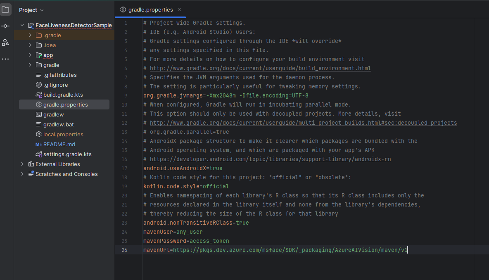
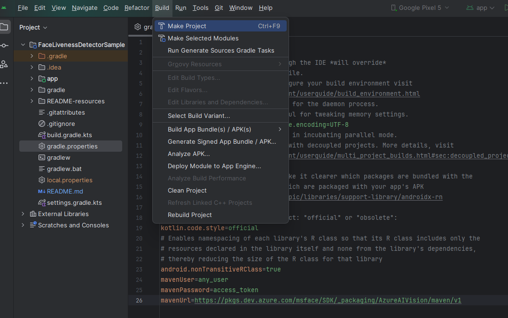

# Get started with the Azure AI Vision Face UI SDK for Android
In this sample, you will learn how to build and run the face liveness detection application.

> **Contents**
>
> * [API Reference Documentation](#api-reference-documentation)
> * [Prerequisites](#prerequisites)
> * [Step 1: Set up the environment](#step-1-set-up-the-environment)
>   * [Step 1.1 Get Access Token to SDK Artifact](#step-11-get-access-token-to-sdk-artifact)
>   * [Step 1.2 Add Credential](#step-12-add-credential)
> * [Step 2: Build and run sample app](#step-2-build-and-run-sample-app)
>   * [Step 2.1 Build the sample app](#step-21-build-the-sample-app)
>   * [Step 2.2 Run the sample](#step-22-run-the-sample)
>   * [Step 2.3 Verification with liveness detection](#step-23-verification-with-liveness-detection)
> * [Step 3 Integrate face liveness detection into your own application](#step-3-integrate-face-liveness-detection-into-your-own-application)
>   * [Step 3.1 The overview of face recognition with liveness detection in Azure AI Vision SDK for Android](#step-31-the-overview-of-face-recognition-with-liveness-detection-in-azure-ai-vision-sdk-for-android)
>   * [Step 3.2 Add Camera Permissions](#step-32-add-camera-permissions)
>   * [Step 3.3 Add Kotlin code to Request Camera Permission](#step-33-add-kotlin-code-to-request-camera-permission)
>   * [Step 3.4 Get Access Token to SDK Artifact](#step-34-get-access-token-to-sdk-artifact)
>   * [Step 3.5 Add Build Dependency](#step-35-add-build-dependency)
>   * [Step 3.6 Add code to interpret the result](#step-36-add-code-to-interpret-the-result)
>   * [Step 3.7 Run liveness flow](#step-37-run-liveness-flow)
>   * [Step 3.8 Add validation for the integrity of the service result](#step-38-add-validation-for-the-integrity-of-the-service-result)
>   * [Step 3.9 Configure Build Tools](#step-39-configure-build-tools)
>     * [Step 3.9.1 ProGuard Exceptions](#step-391-proguard-exceptions)
>     * [Step 3.9.2 DexGuard Exceptions](#step-392-dexguard-exceptions)
> * [FAQ](#faq)
>   * [Q: How can I get the results of the liveness session?](#q-how-can-i-get-the-results-of-the-liveness-session)
>   * [Q: How do I provide localization?](#q-how-do-i-provide-localization)
>   * [Q: How do I override localization and customize the display strings?](#q-how-do-i-override-localization-and-customize-the-display-strings)

## API Reference Documentation
* Kotlin API reference: [azure-ai-vision-face-ui](https://azure.github.io/azure-sdk-for-android/azure-ai-vision-face-ui/index.html)

## Prerequisites 
* An Azure Face API resource subscription.
* A PC (Windows, Linux, Mac) with Android Studio installed.
* An Android mobile device (API level 24 or higher).
* 
## Step 1: Set up the environment

### Step 1.1 Get Access Token to SDK Artifact
The access token is used for maven authentication.  The solution uses azure maven repo artifact to add the binary enabling the liveness feature.  You will need to set up azure maven repo with any username and valid "access token" as "password".  This token will be used as `mavenPassword` in the [Add Build Dependency](#add-build-dependency) section below.
See [GET_FACE_ARTIFACTS_ACCESS](../../../../GET_FACE_ARTIFACTS_ACCESS.md).

### Step 1.2 Add Credential

You need to add credentials in `gradle.properties` to set up variable `mavenUser` and `mavenPassword` used above.  These are obtained through azure command in sdk access.  `mavenPassword` is the access token from above section.  
The creditial is going to look like:
```
mavenUser=any_username_string
mavenPassword=access_token
```


## Step 2: Build and run sample app
The sample app uses the Face UI SDK to perform face liveness detection. The following sections will walk you through these building and running the sample.

### Step 2.1 Build the sample app

Follow these steps to try out the sample app. The app performs liveness detection using the Vision SDK.
* Open the "FaceLivenessDetectorSample" folder on Android Studio.
* Press Ctrl+F9, or select **Build** \> **Make Project**.

### Step 2.2 Run the sample
Follow these steps to download and launch the app on your Android device.
* Your android device must be in developer mode with USB debugging enabled.


* Check that your device has a network connection.
* Connect your device to your development PC.
* Make sure Android Studio recognizes the device. Go to Device Manager in Android Studio, click on the “Physical” tab, and check that your device listed. The app cannot run on an emulator because camera input is needed. 
* Press Shift+F10 or select **Run** \> **Run 'app'**.
* Once the app is installed on the phone, it will ask for camera and storage permissions. Allow these two permissions. 
* Click on the "Settings" button on the main page. Enter in your Face API endpoint and subscription key. Click “Save” if you made any changes.  
* You are now ready to run the app. Click each button to run through each scenario, like liveness and livenessWithVerify.

### Step 2.3 Verification with liveness detection

Verification is a 1-1 matching. You can verify against a face, like the photo on your ID card. 

1. Using your device's camera, take a photo of your ID card. Make sure your face is in the upright position and has not been rotated.
2. Click on the "LivenessWithVerify" button and it will prompt you to upload an image of a face to verify against. Upload the image of your ID card.
3. Click next and show your face to the front-facing camera. As it processes your images, the screen will display user feedback on image quality. The screen will also flash black and white. This is needed for liveness detection. 
4. Once face liveness detection completes, the app will display your verification and liveness results. You should expect a "recognized" and a "live" result. A recognition confidence score is also displayed. 

To test out other liveness detection scenarios, repeat steps 1-5, this time holding up your ID card to the front-facing camera. Since this is not a live face, you should expect a "recognized" and a "spoof" result. 

## Step 3 Integrate face liveness detection into your own application
### Step 3.1 The overview of face recognition with liveness detection in Azure AI Vision SDK for Android
Here is the outline of the SDK sample and integration structure
1. The solution uses azure maven repo artifact to add the binary enabling the liveness feature.  You will need to set up azure `maven` repo with any `username` and valid "access token" as "password.  It will be mentioned below in [Get Access Token to SDK Artifact](#get-access-token-to-sdk-artifact) section for getting the password, along with the [Add Build Dependencies](#add-build-dependency) to set the repo in the solution files.
2. The app requires camera permission.  You will need to set it up in the app configuration and code.  It will be mentioned below in [Add Camera Permission](#add-camera-permissions) and [Add Kotlin code to Request Camera Permission](#add-kotlin-code-to-request-camera-permission) sections for demonstration.
3. There is an compose method called `FaceLivenessDetector`.  The compose component consists a one stop bundle for the liveness feature with UI code.
4. The compose method takes a set of parameters launching it, the parameters defines the liveness session and callback behaviour.  It will be mentioned below in [Add code to interpret the result](#add-code-to-interpret-the-result) section to demostrate how to use it.


### Step 3.2 Add Camera Permissions
Face UI SDK requires access to the camera to perform liveness detection. You need to prompt the user to grant camera permission.  Here is how to add camera permissions and activity data in the manifest:
Add permission for the app in `AndroidManifest.xml`
```
    <uses-permission android:name="android.permission.INTERNET" />
    <uses-permission android:name="android.permission.CAMERA" />
    <uses-permission android:name="android.permission.VIBRATE" />
    <uses-feature android:name="android.hardware.camera" />
    <uses-feature android:name="android.hardware.screen.portrait" />
```
, and now add proper code to request camera permission in kotlin as below

### Step 3.3 Add Kotlin code to Request Camera Permission
You can look at `MainActivity.kt` for sample on how to achieve the same or follow the guidelines for [Android](https://developer.android.com/training/permissions/requesting).  Camera permission needs to be ready before calling the liveness process.
Here is part of the code piece that asks camera permission
```
    private fun requestPermissions() {
        if (ContextCompat.checkSelfPermission(applicationContext, android.Manifest.permission.CAMERA)
            != PackageManager.PERMISSION_GRANTED
        ) {
            ActivityCompat.requestPermissions(
                this,
                arrayOf(android.Manifest.permission.CAMERA),
                cAppRequestCode
            )
        }
    }
```

### Step 3.4 Get Access Token to SDK Artifact
The access token is used for maven authentication.  The solution uses azure maven repo artifact to add the binary enabling the liveness feature.  You will need to set up azure maven repo with any username and valid "access token" as "password".  This token will be used as `mavenPassword` in the "Add Build Dependency" section below.
See [GET_FACE_ARTIFACTS_ACCESS](../../../../GET_FACE_ARTIFACTS_ACCESS.md).

### Step 3.5 Add Build Dependency
* You need to add the following dependencies to apps' build.grade.kts `plugins` section.
```
plugins {
    id("com.android.application")
    id("org.jetbrains.kotlin.android")
    id("org.jetbrains.kotlin.plugin.serialization")
}

```
* You need to add the following dependencies to apps' build.grade.kts `dependencies` section.
```
    implementation("com.azure.ai:azure-ai-vision-face-ui:0.18.1-beta.2")
    implementation("com.azure.android:azure-core-http-httpurlconnection:1.0.0-beta.10")
```
* You need to add repository in the settings.gradle.kts for dependencyResolutionManagement
```
                maven {
                    url = uri("https://pkgs.dev.azure.com/msface/SDK/_packaging/AzureAIVision/maven/v1")
                    credentials {
                        username = mavenUser
                        password = mavenPassword
                    }
                }
```
* You need to add credentials in gradle.properties to set up variable `mavenUser` and `mavenPassword` used above.  These are obtained through azure command from above [Get Access Token to SDK Artifact](#get-access-token-to-sdk-artifact) section.
```
mavenUser=any_username_string
mavenPassword=access_token
```
* If you use ProGuard or DexGuard, please refer to [ProGuard Exceptions](#proguard-exceptions) and [DexGuard Exceptions](#dexguard-exceptions) for details.

### Step 3.6 Add code to interpret the result
The activity takes a set of parameters launching it.  The parameter defines the activity callback behaviour.  The parameters for input are `sessionAuthorizationToken`, `verifyImageFileContent`, `deviceCorrelationId`.  

* sessionAuthorizationToken: session authorization token from the server
* verifyImageFileContent: when choosing livenessWithVerify and setting verify image in the client, this is the ByteArray of the file content of the image.  Otherwise it should be `null`.
* deviceCorrelationId: when choosing not to set deviceCorrelationId in the token creation time, you can put the deviceCorrelationId here.  Otherwise it should be `null`.

The parameters for the callback are `OnSuccess` and `OnError` method.

* OnSuccess: Get called back when the session is completed successfully with `LivenessDetectionSuccess`.  `LivenessDetectionSuccess` shows the liveness session result.

Inside  `LivenessDetectionSuccess`
* digest The validation string to be used to verify the communication for this call is secure.  For more information check section below [Add validation for the integrity of the service result](#add-validation-for-the-integrity-of-the-service-result)
* ResultId The ID to be used to track the result submission process.

* OnError: Get called back when the session is completed successfully with `LivenessDetectionError`.  `LivenessDetectionError` shows the liveness session error reasons.


```
    fun onSuccess(livenessDetectionSuccess: LivenessDetectionSuccess) {
        
        
    }

    fun onError(livenessDetectionError: LivenessDetectionError) {
        
        
    }
```
### Step 3.7 Run liveness flow
Add FaceLivenessDetector in the compose UI.
* "endpoint" is the url for the endpoint server address.

* "session authorization token" should be obtained in App Server.  A demo version on obtaining the token is in `MainScreenViewModel.kt` for the demo app to be built as an standalone solution, but this is not recommended.  The session-authorization-token is required to start a liveness session.  For more information on how to orchestrate the liveness flow by utilizing the Azure AI Vision Face service, visit: https://aka.ms/azure-ai-vision-face-liveness-tutorial.

Then the compose component can be called with the code:
```
FaceLivenessDetector(
            sessionAuthorizationToken = FaceSessionToken.sessionToken,
            verifyImageFileContent = FaceSessionToken.sessionSetInClientVerifyImage,
            deviceCorrelationId = null,
            onSuccess = viewModel::onSuccess,
            onError = viewModel::onError
        )
```
Please note that the detection result isn't present in the client code.  You can retrieve it when calling the detectLiveness-sessions/<session-id> REST call.
You can check [API Reference](https://learn.microsoft.com/rest/api/face/liveness-session-operations/get-liveness-session-result?view=rest-face-v1.2&tabs=HTTP)

### Step 3.8 Add validation for the integrity of the service result
We highly recommend leveraging the "digest" generated within the solution to validate the integrity of the communication between your application and the Azure AI Vision Face service. This is necessary to ensure that the final liveness detection result is trustworthy. "Digest" is provided in the following two locations:
1. "digest" property in LivenessDetectionSuccess shown in [Step 5 Add code to interpret the result](#add-code-to-interpret-the-result)
2. The Azure AI Vision Face service.

   The "digest" will be contained within the liveness detection result when calling the detectLiveness-sessions/<session-id> REST call. Look for an example of the "digest" in the [tutorial](https://aka.ms/azure-ai-vision-face-liveness-tutorial) where the liveness detection result is shown.

   Digests must match between the application and the service. We recommend using these digests in conjunction with platform integrity APIs to perform the final validation.
   For more information on the Integrity APIs, please refer to:
   - [Overview of the Play Integrity API](https://developer.android.com/google/play/integrity/overview)

### Step 3.9 Configure Build Tools
#### Step 3.9.1 ProGuard Exceptions
If you plan to minify your application, you need to add following exceptions to your application's proguard-rules.pro file. 
```
-dontwarn org.slf4j.impl.StaticLoggerBinder
-dontwarn org.slf4j.impl.StaticMDCBinder
-dontwarn org.slf4j.impl.StaticMarkerBinder
```
Alternatively, follow the instructions in the build error message to copy the rules from "missing_rules.txt" file located in your app's `build\outputs\mapping\{releaseVariant}` folder to address these build errors.
#### Step 3.9.2 DexGuard Exceptions
If your application integrates with Dexguard using Gradle plugin, you don't have to do anything special. All the Face UI SDK consumer rules will be automatically picked up by DexGuard.\
If your application is processed by Dexguard command line tool, make sure you include necassary keep rules for Face UI SDK by: 
1. Locate the Face UI SDK aar
2. Extract the `proguard.txt` from the Face UI SDK aar. For details about AAR, refer to [Anatomy of an AAR file](https://developer.android.com/studio/projects/android-library#aar-contents).
3. Include the Face UI SDK consumer rules by adding the following line in your DexGuard configuration file. Make sure to replace `<Path to extracted proguard.txt>` with the actual file path.
    ```
    -include <Path to extracted proguard.txt>
    ```
## FAQ
### Q: How can I get the results of the liveness session?

Once the session is completed, for security reasons the client does not receive the outcome whether face is live or spoof. 

You can query the result from your backend service by calling the sessions results API to get the outcome
https://aka.ms/face/liveness-session/get-liveness-session-result

### Q: How do I provide localization?

The SDK provides default localization for 75 locales.  They should work automatically.  It is provided through `values-` folder in the resources in aar. For more information, [Localize your app](https://developer.android.com/guide/topics/resources/localization).

### Q: How do I override localization and customize the display strings?
Please refer to the localization FAQ answer above.
See [Localization](../../../Localization.md).
