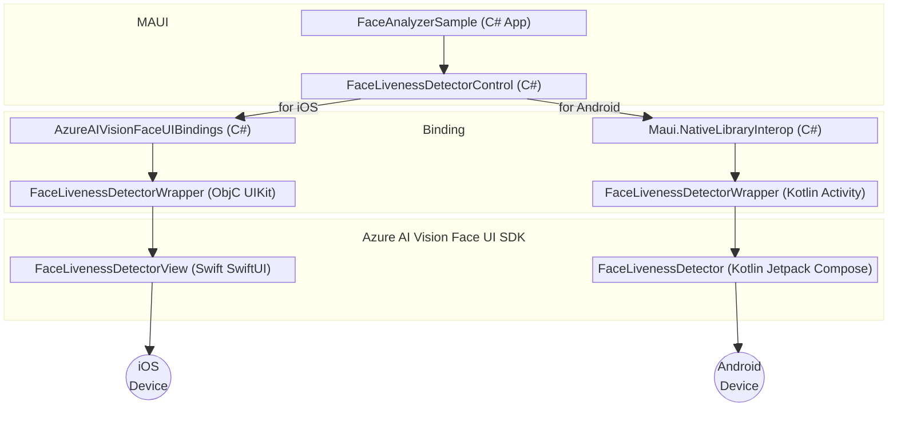

# .NET MAUI Sample for Azure AI Vision Face UI SDK

In this sample, you will learn how to build and run the face liveness detection application with .NET MAUI. This README was written for Visual Studio Code with .NET MAUI Extension.

> **Contents**
>
> * [Prerequisites](#prerequisites)
> * [Step 1: Set up the environment](#step-1-set-up-the-environment)
> * [Step 2: Build and run sample app](#step-2-build-and-run-sample-app)
>   * [Build the sample](#build-the-sample)
>   * [Run the sample](#run-the-sample)

## Prerequisites

1. An Azure Face API resource subscription.
2. A Mac (with [.NET MAUI development environment](https://aka.ms/mauidevkit-marketplace), .NET 9+, Visual Studio Code, Xcode 13+), an iPhone (iOS 14+).
3. An Apple developer account to install and run development apps on the iPhone.
4. An Android phone.

## Step 1: Set up the environment

1. If this is your first time using your .NET MAUI to develop, you should follow [.NET MAUI Installation instructions](https://learn.microsoft.com/dotnet/maui/get-started/installation?view=net-maui-9.0&viewFallbackFrom=net-maui-8.0&tabs=visual-studio-code#install-net-and-net-maui-workloads) before you attempt to build the App here. This will help ensure that your developer environment has been setup properly.
2. Get the access token to access the release artifacts. More details can be found in [GET_FACE_ARTIFACTS_ACCESS.md](../../../../GET_FACE_ARTIFACTS_ACCESS.md).
3. Prepare Git LFS
   * If you have never installed Git LFS, refer to [Git LFS official site](https://git-lfs.github.com/) for instructions.
   * For example:

      ```sh
      # install with homebrew
      brew install git-lfs
      # verify and initialize
      git lfs --version
      git lfs install
      ```

4. The sample app project has been preconfigured to reference the SDK through Swift Package Manager (SPM). Configure the authorization of the git repository from which SPM will pull the package:

   1. Open your global git config file.

      ```sh
      # path will be shown by the following command, then open it using editor
      git config --global --show-origin --list | head -1
      # alternatively default editor will be used if using the following command
      git config --global --edit
      ```

   2. Add the following lines to the global git config file. You may leave out the comments and is provided here for completeness.

      ```config
      [credential "https://msface.visualstudio.com"]
              username = pat
              helper =
              helper = "!f() { test \"$1\" = get && echo \"password=INSERT_PAT_HERE\"; }; f"

              # get PAT from GET_FACE_ARTIFACTS_ACCESS.md and paste ^^^^^^^^^^^^^^^ above, replacing "INSERT_PAT_HERE".
              # username does not matter for PAT so long as it is not left blank.
              # the first blank helper line is necessary to override existing helpers and not a typo.
      ```

   * for other methods of dependency such as CocoaPods, or other methods of git authentication, please refer to the [FAQ](#faq) section of this document.

5. If Xcode Command Line Tools is never installed on your machine, install it first [following instructions from Apple Developer website](https://developer.apple.com/library/archive/technotes/tn2339/_index.html).

6. The sample app project has been preconfigured to reference the SDK through private Maven repository. Configure the authorization of the Maven repository from which Gradle will pull the package:

   1. Add credentials in `gradle.properties` file (relative to this README.md in this repository, the path is `Platforms/Android/AzureAIVisionFaceUIWrapper/gradle.properties`). Populate these lines appropriately (again username does not matter so long as it is not left blank):

   ```properties
   mavenUsername=
   mavenPassword=
   ```

## Step 2: Build and run sample app

### Build the sample

1. Download the sample App folder, extract it but do not open it yet.
2. Run the following command from Terminal, from the directory where AzureAIVisionFaceUIWrapper.xcodeproj is located (Hint: relative to this readme, the path is `Platforms/iOS/AzureAIVisionFaceUIWrapper/AzureAIVisionFaceUIWrapper.xcodeproj`). It will resolve the package through your system Git. Your system Git should already have Git LFS configured, as mentioned in Prerequisites section.

    ```sh
    xcodebuild -scmProvider system -resolvePackageDependencies
    ```

3. This sample creates token on the client, so it needs the API configuration. In production scenario, this will not be necessary. For now, you can fill it in the Settings page during runtime, or go to the FaceAPI.Config.cs (Hint: relative to this readme, the path is `FaceAnalyzerSample/FaceAPI.Config.cs`) and configure the default values, for:
    * API endpoint  
    * Subscription key
4. Select your iPhone or Android phone as target.
5. Build and run the app.

### Run the sample

1. Allow camera permission when prompted.
2. Begin testing.

## FAQ

### Q: What are all the different modules for?

FaceLivenessDetectorControl is the .NET MAUI control that hosts the platform-specific implementation of Face Liveness Detector UI.

On iOS, the SwiftUI View is wrapped inside UIKit and exposed to Objective-C so that the auto-generated AzureAIVisionFaceUIBindings can perform the required interop. FaceLivenessDetectorControl then uses this binding when run on iOS.

On Android, the Jetpack Compose View is wrapped inside `androidx.activity.ComponentActivity` so that it can be bound using Native Library Interop and started from MAUI using `Intent`. FaceLivenessDetectorControl then uses this binding when run on Android.

Refer to the following diagram to learn more about how each component depends on another.



<!-- markdownlint-configure-file
{
  "no-inline-html": {
    "allowed_elements": [
      'br'
    ]
  }
}
-->
