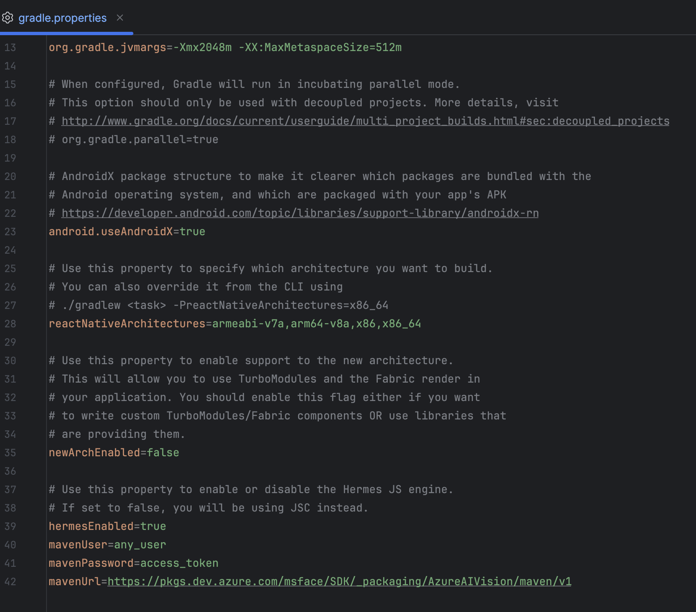
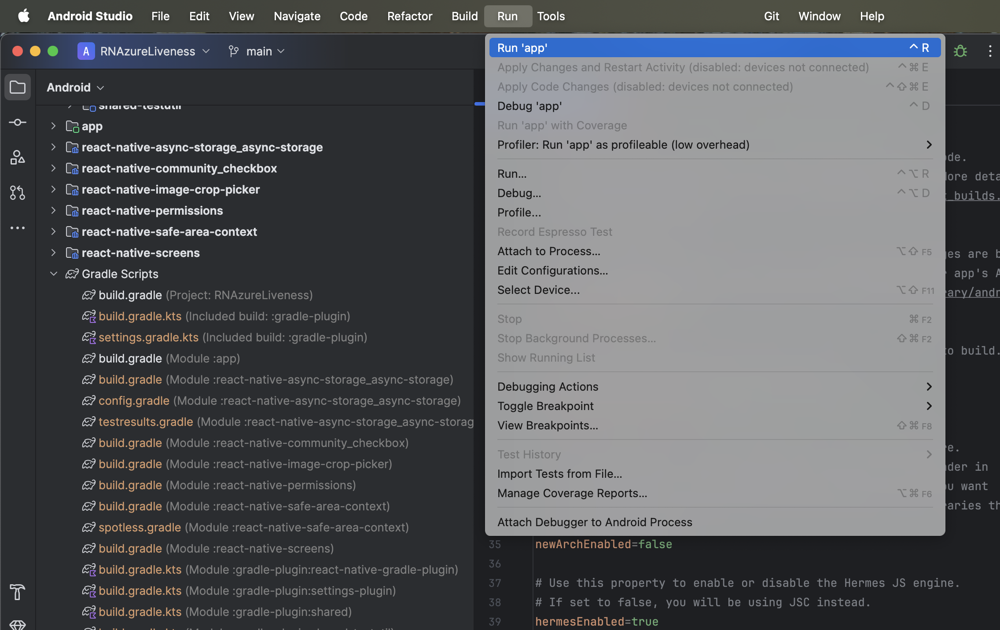
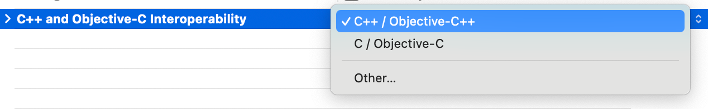
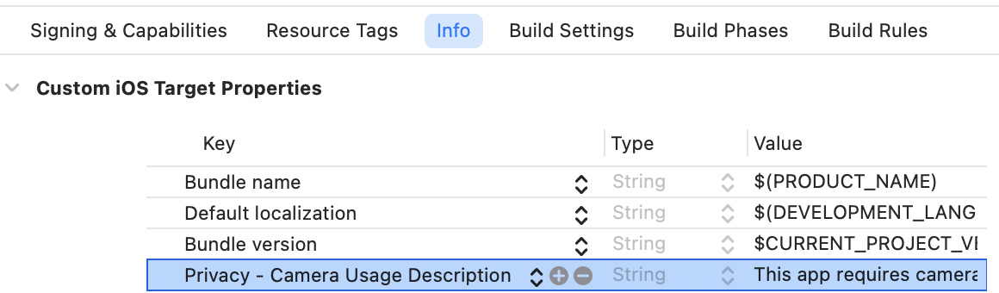

# Get started with the Azure AI Vision Face UI SDK for React Native
In this sample, you will learn how to build and run the face liveness detection application in react native.

> **Contents**
>
> * [API Reference Documentation](#api-reference-documentation)
> * [Prerequisites ](#prerequisites)
> * [Step 1: Set up the environment](#step-1-set-up-the-environment)
>   * [Step 1.1 Get Access Token to SDK Artifact](#step-11-get-access-token-to-sdk-artifact)
>   * [Step 1.2 Add Credential](#step-12-add-credential)
> * [ANDROID INTEGRATION](#android)
> * [iOS INTEGRATION](#iOS)


## API Reference Documentation
* Kotlin API reference: [azure-ai-vision-face-ui](https://azure.github.io/azure-sdk-for-android/azure-ai-vision-face-ui/index.html)

## Prerequisites 
* An Azure Face API resource subscription.
* A PC (Windows, Linux, Mac) with React Native installed with Android Studio and Xcode

## For Android - 
* Android studio minimum (version 2024.3) or higher
* Make sure you have gradle version 8.12
* An Android mobile device (API level 24 or higher).

## Step 1: Set up the environment

### Step 1.1 Get Access Token to SDK Artifact
The access token is used for maven authentication.  The solution uses azure maven repo artifact to add the binary enabling the liveness feature.  You will need to set up azure maven repo with any username and valid "access token" as "password".  This token will be used as `mavenPassword` in the [Add Build Dependency](#step-35-add-build-dependency) section below.
See [GET_FACE_ARTIFACTS_ACCESS](/GET_FACE_ARTIFACTS_ACCESS.md).


### Step 1.2 Add Credential

You need to add credentials in `gradle.properties` to set up variable `mavenUser` and `mavenPassword` used above.  These are obtained through azure command in sdk access.  `mavenPassword` is the access token from above section.  
The credential is going to look like:
```
mavenUser=any_username_string
mavenPassword=access_token
```

## ANDROID

> * [Step 2: Build and run sample app](#step-2-build-and-run-sample-app)
>   * [Step 2.1 Build the sample app](#step-21-build-the-sample-app)
>   * [Step 2.2 Run the sample](#step-22-run-the-sample)
>   * [Step 2.3 Verification with liveness detection](#step-23-verification-with-liveness-detection)
> * [Step 3 Integrate face liveness detection into your own application](#step-3-integrate-face-liveness-detection-into-your-own-application)
>   * [Step 3.1 The overview of face recognition with liveness detection in Azure AI Vision SDK for Android](#step-31-the-overview-of-face-recognition-with-liveness-detection-in-azure-ai-vision-sdk-for-android)
>   * [Step 3.2 Add Camera Permissions](#step-32-add-camera-permissions)
>   * [Step 3.3 Add react native code to Request Camera Permission](#step-33-add-permission-code-to-request-camera-permission)
>   * [Step 3.4 Get Access Token to SDK Artifact](#step-34-get-access-token-to-sdk-artifact)
>   * [Step 3.5 Add Build Dependency](#step-35-add-build-dependency)
>   * [Step 3.6 Add code to interpret the result](#step-36-add-code-to-interpret-the-result)
>   * [Step 3.7 Run liveness flow](#step-37-run-liveness-flow)
>   * [Step 3.8 Add validation for the integrity of the service result](#step-38-add-validation-for-the-integrity-of-the-service-result)
> * [FAQ](#faq)
>   * [Q: How can I get the results of the liveness session?](#q-how-can-i-get-the-results-of-the-liveness-session)
>   * [Q: How do I provide localization?](#q-how-do-i-provide-localization)

## Step 2: Build and run sample app
The sample app uses the Face UI SDK to perform face liveness detection. The following sections will walk you through these building and running the sample.

### Step 2.1 Build the sample app

Follow these steps to try out the sample app. The app performs liveness detection using the Vision SDK.
* In the local.properties file, ensure that the sdk.dir path is correctly set.
* On Android Studio Open the android folder under the "RNLivenessSample" folder 
* Press Ctrl+R, or select **Run** \> **Run app**.

### Step 2.2 Run the sample
Follow these steps to download and launch the app on your Android device.

* Your android device must be in developer mode on with USB debugging enabled.
* Check that your device has a network connection.
* Connect your device to your development PC.
* Make sure Android Studio recognizes the device. Go to Device Manager in Android Studio, click on the “Physical” tab, and check that your device listed. The app cannot run on an emulator because camera input is needed. 
* select **Run** \> **Run 'app'**.
* Once the app is installed on the phone, it will ask for camera and storage permissions. Allow these two permissions. 
* Click on the "Settings" button on the main page. Enter in your Face API endpoint and subscription key. Click “Save” if you made any changes.  
* You are now ready to run the app. Click each button to run through each scenario, like liveness and livenessWithVerify.

### Step 2.3 Verification with liveness detection

Verification is a 1-1 matching. You can verify against a face, like the photo on your ID card. 

1. Using your device's camera, take a photo of your ID card. Make sure your face is in the upright position and has not been rotated.
2. Click on the "LivenessWithVerify" button and it will prompt you to upload an image of a face to verify against. Upload the image of your ID card.
3. Click next and show your face to the front-facing camera. As it processes your images, the screen will display user feedback on image quality. The screen will also flash black and white. This is needed for liveness detection. 
4. Once face liveness detection completes, the app will display your verification and liveness results. You should expect a "recognized" and a "live" result. A recognition confidence score is also displayed. 

To test out other liveness detection scenarios, repeat steps 1-5, this time holding up your ID card to the front-facing camera. Since this is not a live face, you should expect a "recognized" and a "spoof" result. 

## Step 3 Integrate face liveness detection into your React Native application
### Step 3.1 The overview of face recognition with liveness detection in Azure AI Vision SDK for Android
Here is the outline of the SDK sample and integration structure
1. The solution uses azure maven repo artifact to add the binary enabling the liveness feature.  You will need to set up azure `maven` repo with any `username` and valid "access token" as "password.  It will be mentioned below in [Get Access Token to SDK Artifact](#get-access-token-to-sdk-artifact) section for getting the password, along with the [Add Build Dependencies](#add-build-dependency) to set the repo in the solution files.
2. The app requires camera permission.  You will need to set it up in the app configuration and code.  It will be mentioned below in [Add Camera Permission](#add-camera-permissions) and [Add React Native code to Request Camera Permission](#add-react-native-code-to-request-camera-permission) sections for demonstration.
3. There is an compose method called `FaceLivenessDetector`.  The compose component consists a one stop bundle for the liveness feature with UI code.
4. The compose method takes a set of parameters launching it, the parameters defines the liveness session and callback behaviour.  It will be mentioned below in [Add code to interpret the result](#add-code-to-interpret-the-result) section to demostrate how to use it.

### Step 3.2 Add Camera Permissions
Face UI SDK requires access to the camera to perform liveness detection. You need to prompt the user to grant camera permission.  Here is how to add camera permissions and activity data in the manifest:
Add permission for the app in `AndroidManifest.xml`
```
    <uses-permission android:name="android.permission.CAMERA" />
    <uses-feature android:name="android.hardware.camera" />
    <uses-feature android:name="android.hardware.camera.front" android:required="false" />
```

, and now add proper code to request camera permission in react native as below

### Step 3.3 Add react native code to Request Camera Permission
Camera permission needs to be ready before calling the liveness process.
Here is part of the code piece that asks camera permission
```
         PermissionsAndroid.PERMISSIONS.CAMERA,
          {
            title: 'RNAzureLiveness Camera Permission',
            message:
              'RNAzureLiveness needs access to your camera ' +
              'to detect liveness with your face',
            buttonNeutral: 'Ask Me Later',
            buttonNegative: 'Cancel',
            buttonPositive: 'OK',
          },
        );
```

### Step 3.4 Get Access Token to SDK Artifact
The access token is used for maven authentication.  The solution uses azure maven repo artifact to add the binary enabling the liveness feature.  You will need to set up azure maven repo with any username and valid "access token" as "password".  This token will be used as `mavenPassword` in the "Add Build Dependency" section below.
See [GET_FACE_ARTIFACTS_ACCESS](/GET_FACE_ARTIFACTS_ACCESS.md).

### Step 3.5 Add Build Dependency
Android Side
* You need to add the following dependencies to build.gradle (app-level):
```
  plugins {
       id 'com.android.application'
       id 'org.jetbrains.kotlin.android'
       id 'com.facebook.react'
       id 'org.jetbrains.kotlin.plugin.compose' version '2.0.0' // 👈 Add this line
   }

    dependencies {
         implementation("com.azure.android:azure-core-http-okhttp:1.0.0-beta.12")
         implementation("com.azure.ai:azure-ai-vision-face-ui:1.1.0")
         implementation("com.azure.android:azure-core-http-httpurlconnection:1.0.0-beta.10")
         implementation('androidx.appcompat:appcompat:1.7.0')
         implementation('androidx.activity:activity-compose:1.7.2')
         implementation("androidx.compose.ui:ui:1.7.8")
         implementation("androidx.activity:activity-ktx:1.10.1")
         implementation("androidx.fragment:fragment-ktx:1.8.6")
    }
```
* You need to add cred in the android/gradle.properties
```
            mavenUser=mavenUser
            mavenPassword=mavenPassword
            mavenUrl=https://pkgs.dev.azure.com/msface/SDK/_packaging/AzureAIVision/maven/v1
```

* You need to add this in the settings.gradle
```
dependencyResolutionManagement {
     repositoriesMode.set(RepositoriesMode.PREFER_SETTINGS)
     repositories {
         google()
         mavenCentral()
         maven {
             url = uri(mavenUrl)
             credentials {
                 username = mavenUser
                 password = mavenPassword
             }
         }
     }
 }
```
* You need to add credentials in gradle.properties to set up variable `mavenUser` and `mavenPassword` used above.  These are obtained through azure command from above [Get Access Token to SDK Artifact](#get-access-token-to-sdk-artifact) section.
```
mavenUser=any_username_string
mavenPassword=access_token
```

* Enable Jetpack Compose - in build.gradle file:
```
   buildFeatures {
         compose true
     }
 
     composeOptions {
         kotlinCompilerExtensionVersion '1.5.3'
     }
```
### Step 3.6 Add code to interpret the result
The activity takes a set of parameters launching it.  The parameter defines the activity callback behaviour.  The parameters for input are `sessionAuthorizationToken`, `verifyImageFileContent`, `deviceCorrelationId`.  

* sessionAuthorizationToken: session authorization token from the server
* verifyImageFileContent: when choosing livenessWithVerify and setting verify image in the client, this is the ByteArray of the file content of the image.  Otherwise it should be `null`.
* deviceCorrelationId: when choosing not to set deviceCorrelationId in the token creation time, you can put the deviceCorrelationId here.  Otherwise it should be `null`.

### Step 3.7 Run liveness flow

# Create Android native module setup

* Create AzureLivenessModule.kt file
* This Kotlin file defines your native React Native module that calls the Azure Face Liveness activity.

```
    @ReactMethod
    fun startLiveness(token: String, verifyImage: String) {
        val intent = Intent(currentActivity, LivenessActivity::class.java)
        intent.putExtra("sessionToken", token)
        if (!verifyImage.isNullOrBlank()) {
            val byteArray = File(verifyImage).readBytes()
            intent.putExtra("verifyImageFileContent", byteArray)
        } else {
            intent.putExtra("verifyImageFileContent", verifyImage)
        }
        currentActivity?.startActivityForResult(intent, 1110)
    }
```

* Create new LivenessActivity.kt file it is responsible for setting up and managing the Liveness SDK logic, handling initialization, configuration, and result callbacks.
* Launches the Azure Face Liveness SDK using Jetpack Compose – Provides a Compose-based UI flow to start the liveness detection process, display the camera view, and capture the liveness result seamlessly.

```
            FaceLivenessDetector(
                sessionAuthorizationToken = sessionToken,
                verifyImageFileContent = verifyImageFileContent,
                deviceCorrelationId = null,
                onSuccess = { result ->
                    val resultData = Intent().apply {
                        putExtra("status", "success")
                        putExtra("resultId", result.resultId)
                        putExtra("digest", result.digest)
                        putExtra("data", result.toString())

                    }
                    setResult(Activity.RESULT_OK, resultData)
                    finish()
                },
                onError = { error ->
                    val errorData = Intent().apply {
                        putExtra("status", "error")
                        putExtra("livenessError", error.livenessError.toString())
                        putExtra("recognitionError", error.recognitionError.toString())
                        putExtra("data",  error.toString())
                    }
                    setResult(Activity.RESULT_OK, errorData)
                    finish()
                }
            )

```

* To make the AzureLivenessModule.kt accessible in React Native, you need to Create the AzureLivenessPackage.kt file


```
class AzureLivenessPackage : ReactPackage {
     override fun createNativeModules(reactContext: ReactApplicationContext): List<NativeModule> {
         return listOf(AzureLivenessModule(reactContext))
     }
 
     override fun createViewManagers(reactContext: ReactApplicationContext): List<ViewManager<*, *>> {
         return emptyList()
     }
 }
```

* Usage in react native

```
AzureLiveness.startLiveness('YOUR_SESSION_TOKEN', YOUR_IMAGE_BYTES);
```

### Step 3.8 Add validation for the integrity of the service result
We highly recommend leveraging the "digest" generated within the solution to validate the integrity of the communication between your application and the Azure AI Vision Face service. This is necessary to ensure that the final liveness detection result is trustworthy. "Digest" is provided in the following two locations:
1. "digest" property in LivenessDetectionSuccess shown in [Step 5 Add code to interpret the result](#add-code-to-interpret-the-result)
2. The Azure AI Vision Face service.

   The "digest" will be contained within the liveness detection result when calling the detectLiveness-sessions/<session-id> REST call. Look for an example of the "digest" in the [tutorial](https://aka.ms/azure-ai-vision-face-liveness-tutorial) where the liveness detection result is shown.

   Digests must match between the application and the service. We recommend using these digests in conjunction with platform integrity APIs to perform the final validation.
   For more information on the Integrity APIs, please refer to:
   - [Overview of the Play Integrity API](https://developer.android.com/google/play/integrity/overview)


## FAQ
### Q: How can I get the results of the liveness session?

Once the session is completed, for security reasons the client does not receive the outcome whether face is live or spoof. 

You can query the result from your backend service by calling the sessions results API to get the outcome
https://aka.ms/face/liveness-session/get-liveness-session-result


## iOS

> **Contents**
>
> * [API Reference Documentation For iOS](#api-reference-documentation-for-ios)
> * [Prerequisites For iOS](#prerequisites-for-ios)
> * [Step 1: Set up the environment For iOS](#step-1-set-up-the-environment-for-ios)
> * [Step 2: Configure your Xcode Project](#step-2-configure-your-xcode-project)
>   * [Test out key scenarios](#test-out-key-scenarios)
>     * [Liveness](#liveness)
>     * [LivenessWithVerify](#livenesswithverify)
> * [Step 3: Integrate face liveness detection into your own application](#step-3-integrate-face-liveness-detection-into-your-own-application)
> * [FAQ](#faq)
>   * [Q: How do we use CocoaPods or other package managers?](#q-how-do-we-use-cocoapods-or-other-package-managers)
>   * [Q: How can I get the results of the liveness session?](#q-how-can-i-get-the-results-of-the-liveness-session)
>   * [Q: How do I provide localization?](#q-how-do-i-provide-localization)
>   * [Q: How do I customize the displayed strings?](#q-how-do-i-customize-the-displayed-strings)

## API Reference Documentation For iOS

* Swift API reference: [AzureAIVisionFaceUI](https://azure.github.io/azure-sdk-for-ios/AzureAIVisionFaceUI/index.html)

## Prerequisites For iOS

1. An Azure Face API resource subscription.
2. A Mac (with iOS development environment, Xcode 13+), an iPhone (iOS 14+).
3. An Apple developer account to install and run development apps on the iPhone.

## Step 1: Set up the environment For iOS

1. For the best experience, please do not open the sample project in Xcode yet before completing the environment setup.
2. If this is your first time using your Mac to develop, you should build a sample app from [About Me &#x2014; Sample Apps Tutorials | Apple Developer Documentation](https://developer.apple.com/tutorials/sample-apps/aboutme) and run it on your phone before you attempt to build the App here. This will help ensure that your developer environment has been setup properly.
3. Get the access token to access the release artifacts. More details can be found in [GET_FACE_ARTIFACTS_ACCESS.md](../../../../GET_FACE_ARTIFACTS_ACCESS.md).
4. Prepare Git LFS
   * If you have never installed Git LFS, refer to [Git LFS official site](https://git-lfs.github.com/) for instructions.
   * For example:

      ```sh
      # install with homebrew
      brew install git-lfs
      # verify and initialize
      git lfs --version
      git lfs install
      ```

5. The sample app project has been preconfigured to reference the SDK through Swift Package Manager (SPM). Configure the authorization of the git repository from which SPM will pull the package:

   1. Open your global git config file.

      ```sh
      # path will be shown by the following command, then open it using editor
      git config --global --show-origin --list | head -1
      # alternatively default editor will be used if using the following command
      git config --global --edit
      ```

   2. Add the following lines to the global git config file. You may leave out the comments and is provided here for completeness.

      ```config
      [credential "https://msface.visualstudio.com"]
              username = pat
              helper =
              helper = "!f() { test \"$1\" = get && echo \"password=INSERT_PAT_HERE\"; }; f"

              # get PAT from GET_FACE_ARTIFACTS_ACCESS.md and paste ^^^^^^^^^^^^^^^ above, replacing "INSERT_PAT_HERE".
              # username does not matter for PAT so long as it is not left blank.
              # the first blank helper line is necessary to override existing helpers and not a typo.
      ```

   * for other methods of dependency such as CocoaPods, or other methods of git authentication, please refer to the [FAQ](#faq) section of this document.

6. If Xcode Command Line Tools is never installed on your machine, install it first [following instructions from Apple Developer website](https://developer.apple.com/library/archive/technotes/tn2339/_index.html).


## Step 2: Configure your Xcode Project

   1. In Xcode → Targets → Build Settings → Swift Compiler - Language, select the C++ and Objective-C Interoperability to be C++ / Objective-C++
      
   2. In Xcode → Targets → Info → Custom iOS Target Properties, add Privacy - Camera Usage Description.
      
   3. Install pods and run


### Test out key scenarios

#### Liveness

1. Tap "Liveness" then "Start" and show your face.
2. The screen flashes for liveness analysis.
3. Observe the Real/Spoof status.

#### LivenessWithVerify

1. Tap "LivenessWithVerify" then select a reference face image.
2. Show your face to the camera.
3. Observe the Real/Spoof status, verification status, and confidence score.


## Step 3: Integrate face liveness detection into your own application

podfile -

```
source 'https://msface.visualstudio.com/SDK/_git/AzureAIVisionFaceUI.podspec'
source 'https://github.com/CocoaPods/Specs.git'
```

* after update podfile install the pod or update

* Create a Native Module for AzureLiveness
* AzureLiveness.swift
```
  @objc(startLivenessDetection:isLiveness:)
  func startLivenessDetection(sessionToken: String, isLiveNess: String) {
    DispatchQueue.main.async {
      guard let rootVC = UIApplication.shared.delegate?.window??.rootViewController else {
        self.sendEvent(withName: "LivenessResultEvent", body: [
          "status": "error",
          "message": "Could not find root view controller"
        ])
        return
      }

      let resultBinding = Binding<LivenessDetectionResult?>(
        get: { nil },
        set: { result in
          guard let result = result else { return }

          var resultMap: [String: Any] = [:]

          switch result {
          case .success(let success):
            resultMap["status"] = "success"
            resultMap["resultId"] = success.resultId
            resultMap["digest"] = success.digest
            resultMap["isLiveNess"] = isLiveNess

          case .failure(let failure):
            resultMap["status"] = "failure"
            resultMap["isLiveNess"] = isLiveNess
            resultMap["message"] = failure.localizedDescription
            if let resultId = failure.resultId {
              resultMap["resultId"] = resultId
            }
          }

          if self.hasListeners {
            self.sendEvent(withName: "LivenessResultEvent", body: resultMap)
          }

          rootVC.dismiss(animated: true, completion: nil)
        }
      )

      let livenessView = FaceLivenessDetectorView(
        result: resultBinding,
        sessionAuthorizationToken: sessionToken
      )

      let controller = UIHostingController(rootView: AnyView(livenessView))
      rootVC.present(controller, animated: true, completion: nil)
    }
  }

```

* AzureFaceLivenessBridge.m
```
#import <React/RCTBridgeModule.h>
#import <React/RCTEventEmitter.h>

@interface RCT_EXTERN_MODULE(AzureLivenessManager, RCTEventEmitter)

//RCT_EXTERN_METHOD(startLivenessDetection:(NSString *)sessionToken)

RCT_EXTERN_METHOD(startLivenessDetection:(NSString *)sessionToken
                  isLiveness:(NSString *)isLiveness)

@end
```

* Usage in react native

```
await AzureLivenessManager.startLivenessDetection('YOUR_SESSION_TOKEN');
```

## FAQ

### Q: How do we use CocoaPods or other package managers?

Add the following lines to your project's Podfile. `'YourBuildTargetNameHere'` is an example target, and you should use your actual target project instead. You can also [specify your version requirement](https://guides.cocoapods.org/using/the-podfile.html#specifying-pod-versions) as needed.

# add repo as source
source 'https://msface.visualstudio.com/SDK/_git/AzureAIVisionFaceUI.podspec'
target 'YourBuildTargetNameHere' do
   # add the pod here, optionally with version specification as needed
   pod 'AzureAIVisionFaceUI'
end

Also read: CocoaPods ([CocoaPods Guides - Getting Started](https://guides.cocoapods.org/using/getting-started.html))

For other package managers, please consult their documentation and clone the framework repo manually.

### Q: Are there alternatives for access authorization?
There are some situations where the example plaintext token inside global git-config may not be suitable for your needs, such as automated build machines.

If you are using `git-credential-manager`, `credential.azreposCredentialType` needs to be set to `pat`.

The example above uses `credential.helper` approach of `git-config`. Aside from storing it directly inside the config file, there are alternate ways to provide the token to `credential.helper`. Read [custom helpers section of the `gitcredentials` documentation](https://git-scm.com/docs/gitcredentials#_custom_helpers) for more information.

To use [`http.extraHeader` approach of `git-config`](https://git-scm.com/docs/git-config/2.22.0#Documentation/git-config.txt-httpextraHeader), you need to convert the token to base64 format. Refer to [the **Use a PAT** section of this Azure DevOps documentation article](https://learn.microsoft.com/azure/devops/organizations/accounts/use-personal-access-tokens-to-authenticate?view=azure-devops&tabs=Linux#use-a-pat). Note that instead of using the git clone invocation as shown in the example, you should call:

```sh
MY_PAT=accessToken
HEADER_VALUE=$(printf "Authorization: Basic %s" "$MY_PAT" | base64)
git config --global http.https://msface.visualstudio.com/SDK.extraHeader "${HEADER_VALUE}"
```

For other types of Git installation, refer to [the **Credentials** section of Git FAQ](https://git-scm.com/docs/gitfaq#_credentials).

### Q: How can I get the results of the liveness session?

Once the session is completed, for security reasons the client does not receive the outcome whether face is live or spoof.

You can query the result from your backend service by calling the sessions results API to get the outcome [[API Reference](https://aka.ms/face/liveness-session/get-liveness-session-result)].

### Q: How do I provide localization?

The SDK provides default localization for 75 locales. The strings can be customized for each localization by following this guide by Apple: [Localizing and varying text with a string catalog](https://developer.apple.com/documentation/xcode/localizing-and-varying-text-with-a-string-catalog). Please refer to [this document](https://aka.ms/face/liveness/sdk/docs/localization) for the keys of the strings.

### Q: How do I customize the displayed strings?

Please refer to the localization FAQ answer above.

<!-- markdownlint-configure-file
{
  "no-inline-html": {
    "allowed_elements": [
      'br'
    ]
  }
}
-->
