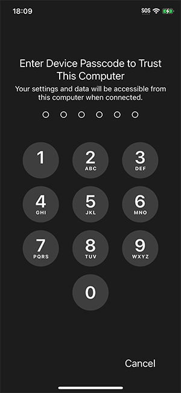
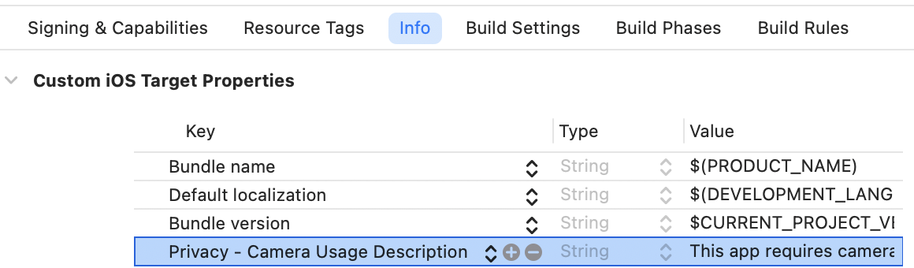

# Get started with the Azure AI Vision Face UI SDK for iOS

In this sample, you will learn how to build and run the face liveness detection application.

> **Contents**
>
> * [API Reference Documentation](#api-reference-documentation)
> * [Prerequisites](#prerequisites)
> * [Step 1: Set up the environment](#step-1-set-up-the-environment)
> * [Step 2: Build and run sample app](#step-2-build-and-run-sample-app)
>   * [Build the sample](#build-the-sample)
>   * [Run the sample](#run-the-sample)
>   * [Test out key scenarios](#test-out-key-scenarios)
>     * [Liveness](#liveness)
>     * [LivenessWithVerify](#livenesswithverify)
> * [Step 3: Integrate face liveness detection into your own application](#step-3-integrate-face-liveness-detection-into-your-own-application)
> * [FAQ](#faq)
>   * [Q: How do we use CocoaPods or other package managers?](#q-how-do-we-use-cocoapods-or-other-package-managers)
>   * [Q: Are there alternatives for access authorization?](#q-are-there-alternatives-for-access-authorization)
>   * [Q: How can I get the results of the liveness session?](#q-how-can-i-get-the-results-of-the-liveness-session)
>   * [Q: How do I provide localization?](#q-how-do-i-provide-localization)
>   * [Q: How do I customize the displayed strings?](#q-how-do-i-customize-the-displayed-strings)

## API Reference Documentation

* Swift API reference: [AzureAIVisionFaceUI](https://azure.github.io/azure-sdk-for-ios/AzureAIVisionFaceUI/index.html)

## Prerequisites

1. An Azure Face API resource subscription.
2. A Mac (with iOS development environment, Xcode 13+), an iPhone (iOS 14+).
3. An Apple developer account to install and run development apps on the iPhone.

## Step 1: Set up the environment

1. For the best experience, please do not open the sample project in Xcode yet before completing the environment setup.
2. If this is your first time using your Mac to develop, you should build a sample app from [About Me &#x2014; Sample Apps Tutorials | Apple Developer Documentation](https://developer.apple.com/tutorials/sample-apps/aboutme) and run it on your phone before you attempt to build the App here. This will help ensure that your developer environment has been setup properly.
3. Get the access token to access the release artifacts. More details can be found in [GET_FACE_ARTIFACTS_ACCESS.md](../../../../GET_FACE_ARTIFACTS_ACCESS.md).
4. Prepare Git LFS
   * If you have never installed Git LFS, refer to [Git LFS official site](https://git-lfs.github.com/) for instructions.
   * For example:

      ```sh
      # install with homebrew
      brew install git-lfs
      # verify and initialize
      git lfs --version
      git lfs install
      ```

5. The sample app project has been preconfigured to reference the SDK through Swift Package Manager (SPM). Configure the authorization of the git repository from which SPM will pull the package:

   1. Open your global git config file.

      ```sh
      # path will be shown by the following command, then open it using editor
      git config --global --show-origin --list | head -1
      # alternatively default editor will be used if using the following command
      git config --global --edit
      ```

   2. Add the following lines to the global git config file. You may leave out the comments and is provided here for completeness.

      ```config
      [credential "https://msface.visualstudio.com"]
              username = pat
              helper =
              helper = "!f() { test \"$1\" = get && echo \"password=INSERT_PAT_HERE\"; }; f"

              # get PAT from GET_FACE_ARTIFACTS_ACCESS.md and paste ^^^^^^^^^^^^^^^ above, replacing "INSERT_PAT_HERE".
              # username does not matter for PAT so long as it is not left blank.
              # the first blank helper line is necessary to override existing helpers and not a typo.
      ```

   * for other methods of dependency such as CocoaPods, or other methods of git authentication, please refer to the [FAQ](#faq) section of this document.

6. If Xcode Command Line Tools is never installed on your machine, install it first [following instructions from Apple Developer website](https://developer.apple.com/library/archive/technotes/tn2339/_index.html).

## Step 2: Build and run sample app

### Build the sample

1. Download the sample App folder, extract it but do not open it yet.
2. Run the following command from Terminal, from the directory where your .xcodeproj is located, as appropriate for your project. It will resolve the package through your system Git. Your system Git should already have Git LFS configured, as mentioned in Prerequisites section.

    ```sh
    xcodebuild -scmProvider system -resolvePackageDependencies
    ```

3. Open the .xcodeproj file.
   <br>
   
4. Verify the package dependency through Swift Package Manager or other methods as described above.
5. In **Xcode → Targets → Signing & Capabilities**, set the App bundle identifier and developer team.
   <br><br>
   
6. Connect your iPhone to the Mac, then trust the Mac when prompted.
   <br><br>
    
7. Select your iPhone in the Xcode top bar.
   <br><br>
   
8. Build and run the app.

### Run the sample

1. Allow camera permission when prompted.  
2. This sample creates token on the client, so it needs the API configuration. In production scenario, this will not be necessary. For now, go to the settings page and configure:
    * API endpoint  
    * Subscription key
3. Try one of the buttons (such as “Liveness”) to begin testing.

### Test out key scenarios

#### Liveness

1. Tap "Liveness" then "Start" and show your face.
2. The screen flashes for liveness analysis.
3. Observe the Real/Spoof status.

#### LivenessWithVerify

1. Tap "LivenessWithVerify" then select a reference face image.
2. Show your face to the camera.
3. Observe the Real/Spoof status, verification status, and confidence score.

## Step 3: Integrate face liveness detection into your own application

1. Configure your Xcode project
   1. In **Xcode → Targets → Build Settings → Swift Compiler - Language**,  select the **C++ and Objective-C Interoperability** to be **C++ / Objective-C++**
   <br><br>
   
   2. In **Xcode → Targets → Info → Custom iOS Target Properties**, add **[Privacy - Camera Usage Description](https://developer.apple.com/documentation/bundleresources/information-property-list/nscamerausagedescription)**.
   <br><br>
   

2. Add package dependency by adding AzureAIVisionFaceUI.xcframework in **Xcode → Files → Add Package Dependencies** for Swift Package Manager. See [FAQ](#faq) for other dependency management tools.
   <br><br>
   
   1. In **Search or Enter Package URL** text box, enter `https://msface.visualstudio.com/SDK/_git/AzureAIVisionFaceUI.xcframework`.
      <br><br>
      
   2. You will be prompted for credentials. Insert the token from [GET_FACE_ARTIFACTS_ACCESS.md](../../../../GET_FACE_ARTIFACTS_ACCESS.md) as the password. The username does not matter here so long as it is not left blank
      <br><br>
      
   3. Add the package
      <br><br>
      
   4. Package resolution will fail. Select **Add Anyway**.
      <br><br>
      
   5. AzureAIVisionFaceUI.xcframework will show up under **Package Dependencies** with red crossed icon.
      <br><br>
      
   6. Close Xcode window of your project.
   7. Run the following command from Terminal, from the directory where your .xcodeproj is located, as appropriate for your project. It will resolve the package through your system Git. Your system Git should already have Git LFS configured, as mentioned in Prerequisites section.

      ```sh
      xcodebuild -scmProvider system -resolvePackageDependencies
      ```

   8. After the command succeeds, open the project again in Xcode. The package should be resolved properly.
      <br><br>
      

3. Insert `FaceLivenessDetectorView`. Respond to the update of the passed binding in your `View`.
In `MainView.swift` example, the `View` uses `onChange(of:perform:)` to demonstrate a more imperative way of handling the result, but you can also use a more SwiftUI-esque declarative way of handling the result, like:

   ```swift
   struct HostView: View {
       @State var livenessDetectionResult: LivenessDetectionResult? = nil
       var token: String
       var body: some View {
           if livenessDetectionResult == nil {
               FaceLivenessDetectorView(result: $livenessDetectionResult,
                                        sessionAuthorizationToken: token)
           } else if let result = livenessDetectionResult {
               VStack {
                   switch result { 
                       case .success(let success):
                       /// <#show success#>
                       case .failure(let error):
                       /// <#show failure#>
                   }
               }
           }
       }
   }
   ```

4. Obtain the session authorization token from your service and update the view accordingly. See `obtainToken` function in the sample, used in `LaunchView.swift` and defined in `AppUtility.swift` for a basic token retrieval demo.

5. Compare `digest` from both the client's `LivenessDetectionSuccess` instance and service response to ensure integrity. For more details, see [DeviceCheck | Apple Developer Documentation](https://developer.apple.com/documentation/devicecheck)

## FAQ

### Q: How do we use CocoaPods or other package managers?

Add the following lines to your project's Podfile. `'YourBuildTargetNameHere'` is an example target, and you should use your actual target project instead. You can also [specify your version requirement](https://guides.cocoapods.org/using/the-podfile.html#specifying-pod-versions) as needed.

```ruby
# add repo as source
source 'https://msface.visualstudio.com/SDK/_git/AzureAIVisionFaceUI.podspec'
target 'YourBuildTargetNameHere' do
   # add the pod here, optionally with version specification as needed
   pod 'AzureAIVisionFaceUI'
end
```

Also read: CocoaPods ([CocoaPods Guides - Getting Started](https://guides.cocoapods.org/using/getting-started.html))

For other package managers, please consult their documentation and clone the framework repo manually.

### Q: Are there alternatives for access authorization?

There are some situations where the example plaintext token inside global `git-config` may not be suitable for your needs, such as automated build machines.

If you are using `git-credential-manager`, `credential.azreposCredentialType` needs to be set to `pat`.

The example above uses `credential.helper` approach of `git-config`. Aside from storing it directly inside the config file, there are alternate ways to provide the token to `credential.helper`. Read [custom helpers section of the `gitcredentials` documentation](https://git-scm.com/docs/gitcredentials#_custom_helpers) for more information.

To use [`http.extraHeader` approach of `git-config`](https://git-scm.com/docs/git-config/2.22.0#Documentation/git-config.txt-httpextraHeader), you need to convert the token to base64 format. Refer to [the **Use a PAT** section of this Azure DevOps documentation article](https://learn.microsoft.com/azure/devops/organizations/accounts/use-personal-access-tokens-to-authenticate?view=azure-devops&tabs=Linux#use-a-pat). Note that instead of using the git clone invocation as shown in the example, you should call:

```sh
MY_PAT=accessToken
HEADER_VALUE=$(printf "Authorization: Basic %s" "$MY_PAT" | base64)
git config --global http.https://msface.visualstudio.com/SDK.extraHeader "${HEADER_VALUE}"
```

For other types of Git installation, refer to [the **Credentials** section of Git FAQ](https://git-scm.com/docs/gitfaq#_credentials).

### Q: How can I get the results of the liveness session?

Once the session is completed, for security reasons the client does not receive the outcome whether face is live or spoof. 

You can query the result from your backend service by calling the sessions results API to get the outcome
https://aka.ms/face/liveness-session/get-liveness-session-result

### Q: How do I provide localization?

The SDK provides default localization for 75 locales. The strings can be customized for each localization by following this guide by Apple: [Localizing and varying text with a string catalog](https://developer.apple.com/documentation/xcode/localizing-and-varying-text-with-a-string-catalog). Please refer to [this document](https://aka.ms/face/liveness/sdk/docs/localization) for the keys of the strings.

### Q: How do I customize the displayed strings?

Please refer to the localization FAQ answer above.

<!-- markdownlint-configure-file
{
  "no-inline-html": {
    "allowed_elements": [
      'br'
    ]
  }
}
-->
