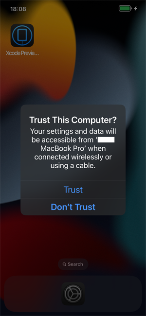
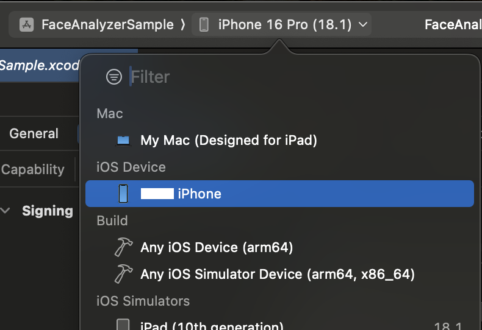

# Get started with the Azure AI Vision Face UI SDK for iOS

In this sample, you will learn how to build and run the face liveness detection application.

> **Contents**
>
> * [API Reference Documentation](#api-reference-documentation)
> * [Prerequisites](#prerequisites)
> * [Step 1: Set up the environment](#step-1-set-up-the-environment)
> * [Step 2: Build and run sample app](#step-2-build-and-run-sample-app)
>   * [Build the sample](#build-the-sample)
>   * [Run the sample](#run-the-sample)
>   * [Test out key scenarios](#test-out-key-scenarios)
>     * [Liveness](#liveness)
>     * [LivenessWithVerify](#livenesswithverify)

## API Reference Documentation

* Swift API reference: [AzureAIVisionFaceUI](https://azure.github.io/azure-sdk-for-ios/AzureAIVisionFaceUI/index.html)

## Prerequisites

1. An Azure Face API resource subscription.
2. A Mac (with iOS development environment, Xcode 13+), an iPhone (iOS 14+).
3. An Apple developer account to install and run development apps on the iPhone.

## Step 1: Set up the environment

1. **Prepare Xcode environment**: For the best experience, please do not open the sample project in Xcode yet before completing the environment setup.

2. **Verify iOS development setup**: If this is your first time using your Mac to develop, you should build a sample app from [About Me &#x2014; Sample Apps Tutorials | Apple Developer Documentation](https://developer.apple.com/tutorials/sample-apps/aboutme) and run it on your phone before you attempt to build the App here. This will help ensure that your developer environment has been setup properly.

3. **Get PAT access token**: <a id="get-access-token"></a>Fetch the PAT access token required for downloading release artifacts, using the API: [Get Client Assets Access Token](https://learn.microsoft.com/rest/api/face/liveness-session-operations/get-client-assets-access-token?view=rest-face-v1.3-preview)

4. **Install Git LFS**: Prepare Git LFS
   * If you have never installed Git LFS, refer to [Git LFS official site](https://git-lfs.github.com/) for instructions.
   * For example:

      ```sh
      # install with homebrew
      brew install git-lfs
      # verify and initialize
      git lfs --version
      git lfs install
      ```

5. **Configure Git authentication**: The sample app project has been preconfigured to reference the SDK through Swift Package Manager (SPM). Configure the authorization of the git repository from which SPM will pull the package:

   5.1. Open your global git config file.

      ```sh
      # path will be shown by the following command, then open it using editor
      git config --global --show-origin --list | head -1
      # alternatively default editor will be used if using the following command
      git config --global --edit
      ```

   5.2. Get the PAT access token from [step 3](#get-access-token) above, then add it to the config:

      ```config
      [credential "https://msface.visualstudio.com"]
              username = pat
              helper =
              helper = "!f() { test \"$1\" = get && echo \"password=INSERT_PAT_HERE\"; }; f"

              # get PAT from Get Client Assets Access Token REST API and paste ^^^^^^^^^^^^^^^ above, replacing "INSERT_PAT_HERE".
              # username does not matter for PAT so long as it is not left blank.
              # the first blank helper line is necessary to override existing helpers and not a typo.
      ```

   * for other methods of dependency such as CocoaPods, or other methods of git authentication, please refer to the [FAQ](#faq) section of this document.

6. **Install Xcode Command Line Tools**: If Xcode Command Line Tools is never installed on your machine, install it first [following instructions from Apple Developer website](https://developer.apple.com/library/archive/technotes/tn2339/_index.html).

## Step 2: Build and run sample app

### Build the sample

1. Download the sample App folder, extract it but do not open it yet.
2. Run the following command from Terminal, from the directory where your .xcodeproj is located, as appropriate for your project. It will resolve the package through your system Git. Your system Git should already have Git LFS configured, as mentioned in Prerequisites section.

    ```sh
    xcodebuild -scmProvider system -resolvePackageDependencies
    ```

3. Open the .xcodeproj file.
   <br>
   
4. Verify the package dependency through Swift Package Manager or other methods as described above.
5. In **Xcode → Targets → Signing & Capabilities**, set the App bundle identifier and developer team.
   <br><br>
   
6. Connect your iPhone to the Mac, then trust the Mac when prompted.
   <br><br>
    
7. Select your iPhone in the Xcode top bar.
   <br><br>
   
8. Build and run the app.

### Run the sample

1. Allow camera permission when prompted.  
2. This sample creates token on the client, so it needs the API configuration. In production scenario, this will not be necessary. For now, go to the settings page and configure:
    * API endpoint  
    * Subscription key
3. Try one of the buttons (such as “Liveness”) to begin testing.

### Test out key scenarios

#### Liveness

1. Tap "Liveness" then "Start" and show your face.
2. The screen flashes for liveness analysis.
3. Observe the Real/Spoof status.

#### LivenessWithVerify

1. Tap "LivenessWithVerify" then select a reference face image.
2. Show your face to the camera.
3. Observe the Real/Spoof status, verification status, and confidence score.